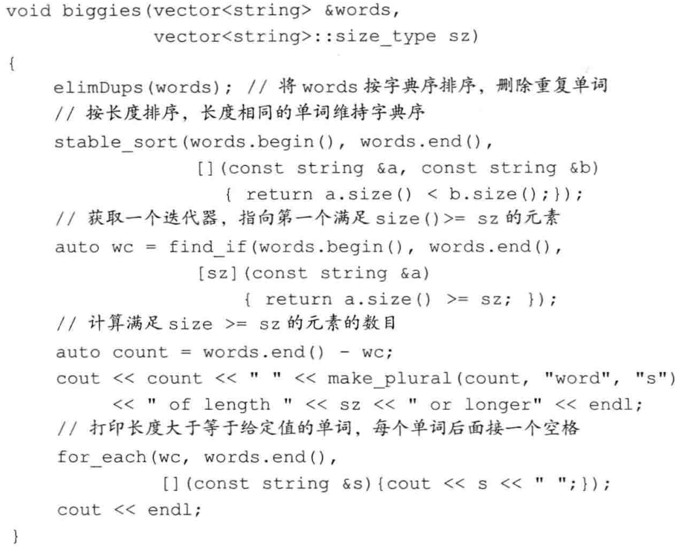
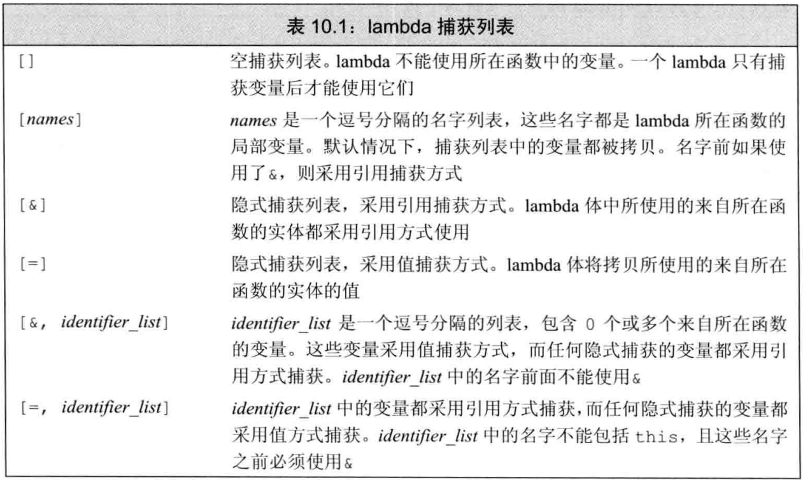
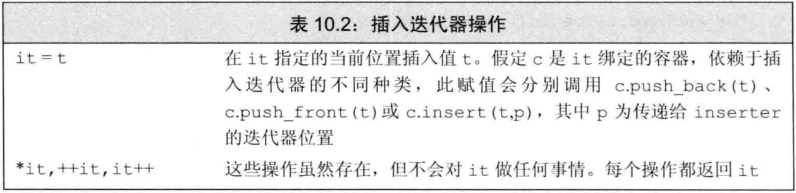
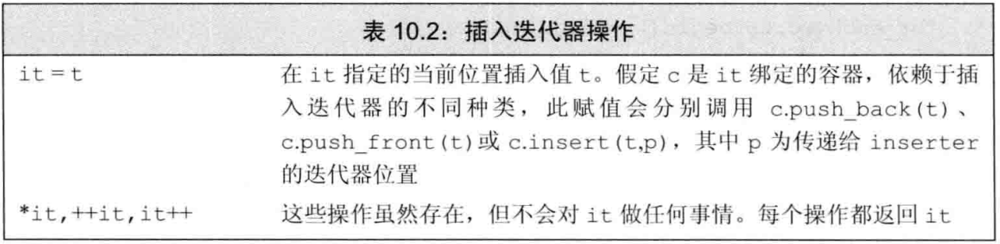
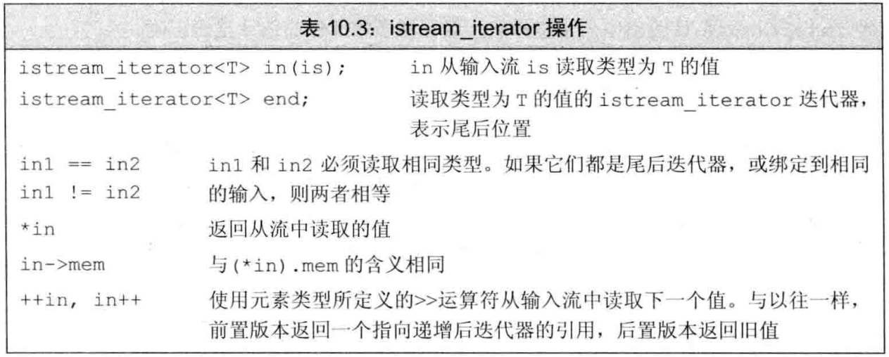
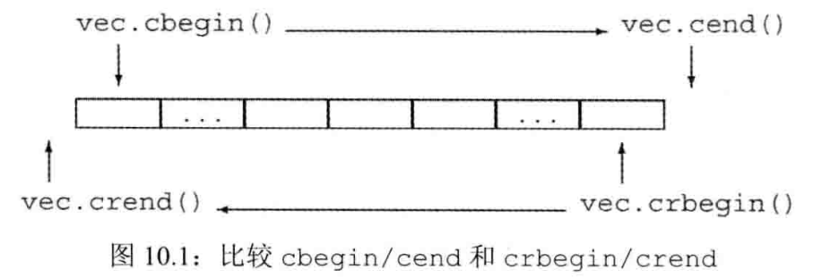
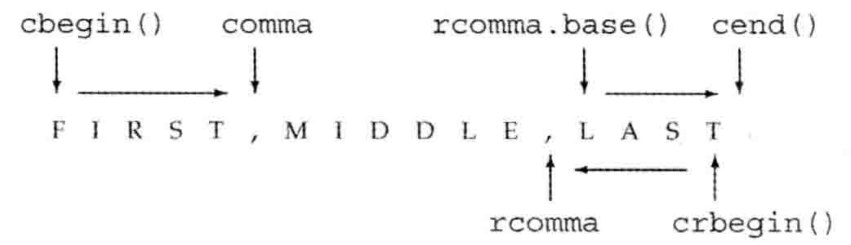
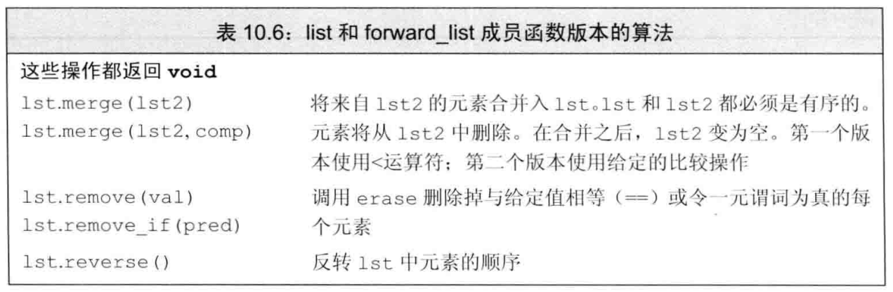
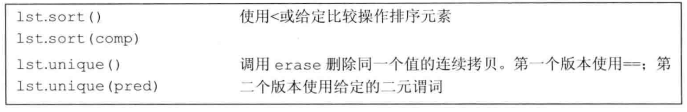
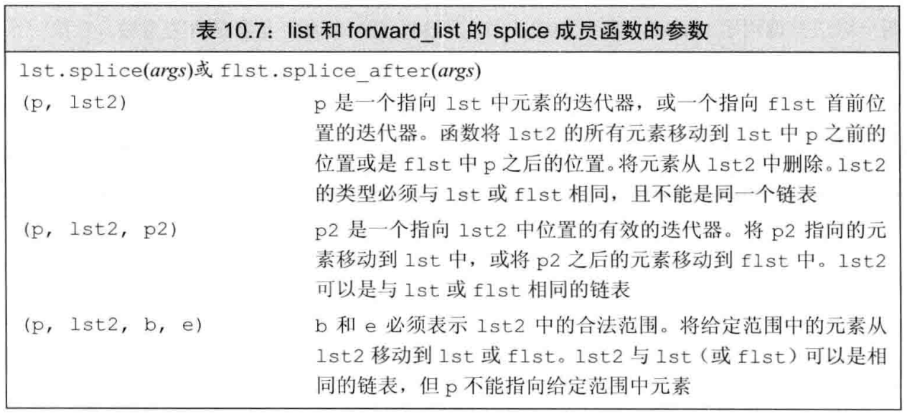

# 第十章 泛型算法
@(Coding)[C++, 笔记, C++ Primer]
## 10.1 概述
```
#include<algorithm>	///大多数泛型算法
#include<numeric>	///数值泛型算法
```

```
auto result = find(vec.cbegin(), vec.cend(), val);	//vec vector
auto result = find(begin(ia), end(ia), val);	///ia 数组
auto result = find(ia+1, ia+4, val);
```

迭代器令算法不依赖与容器,但依赖于元素类型的操作. 泛型算法不会执行容器的操作,只会运行于迭代器之上,执行迭代器的操作.算法永不会改变容器的大小,只会修改元素值或是移动元素.

特殊的迭代器-插入器,这样使迭代器完成插入操作.

## 10.2 初始泛型算法
### 10.2.1 只读算法
find\count\accumulate\equal
**accumulate**:
```
#include<numeric>
int sum = accumulate(vec.cbegin(), vec.cend(), 0);	///未改变元素,使用cbegin\cend
std::string sum = accumulate(v.cbegin(), v.cend(), string(""));	//显式定义string型空字符串
std::string sum = accumulate(v.cbegin(), v.cend(), "");	///错误,""为const char*类型,未定义"+"
```
accumulate使用了"+"运算符, string也可用.

**equal**:
```
vector<string> r1;
list<const char*> r2;
equal(r1.cbegin(), r1.cend(), r2.cbegin());	///r2长度不小于r1
```
equal利用迭代器比较元素, 因此容器类型不一致,也可以元素类型不一致,只要两者元素能通过"=="比较即可

### 10.2.2 写容器元素的算法
**fill**
```
fill(vec.begin(), vec.end(), 0);	//每个元素置0
fill(vec.begin(), vec.begin() + vec.size()/2, 10);
```
0.5个输入范围(fill_n), 1个输入范围(fill), 1.5个输入范围(equal), 2个输入范围
对于1.5个输入范围的算法,第二个长度要小于第一个,第二个范围是第一个的子集,程序会出现严重错误.equal会访问第二个序列中末尾之后(不存在)的元素.

**fill_n**
从迭代器指定的位置开始修改指定数量新值
```
vector<int> vec;
fill_n(vec.begin(), vec.size(), 0);
```
fill_n的作用是修改元素值,不能添加元素值.,切忌在空容器使用
向目的位置迭代器写入数据的前提是,容器足够大!!

**back_inserter**
插入迭代器,将一个赋值号右侧的值添加到容器中(使用back_push).
```
#include<iterator>
vector<int> vec;
auto it = back_inserter(vec);	///形参为容器的引用,返回值为绑定的插入迭代器.通过它赋值将元素插入到vec中
*it = 42;	///vec被添加一个为42的元素
```
用法: 使用back_inserter创建一个迭代器.
```
fill_n(back_inserter(vec), 10, 0);	///在vec末尾添加了10个值0的元素
```

**拷贝算法**
```
auto ret = copy(begin(a1), end(a1), a2);	///把a1内容拷贝给a2
```
copy(begin, end, another begin); another begin不小于输入范围,**返回目的位置迭代器递增后的值**,即新容器的尾后指针.
很多算法提供"拷贝"版本,这些算法计算新元素的值,但不会将它们放置在输入序列的末尾,而是创建一个新序列保存这些结果.
```
replace(ilst.begin(), ilist.end(), 0, 42); ///将ilist中0全部替换为42
```
replace(begin, end, old_val, new_val); 
```
replace_copy(ilst.begin(), ilist.end(), back_inserter(ivec), 0, 42); ///将ilist未改变,ivec后被添加ilist的拷贝(0变42).
```
replace_copy(begin, end, addr, old_val, new_val);  ///在addr处添加输入范围的拷贝,且拷贝中的old_val被替换成new_val.

### 10.2.3 重排容器元素的算法
sort: 利用元素类型的<运算符字典序重排

```
sort(words.begin(), words.end());	///字典序排序words
auto end_unique = unique(words.begin(), words.end());	///不重复字典序重排,重复的放在其后面.
words.erase(end_unique, words.end());	///删除重复部分
```

**unique**
unique: 相邻的重复项后置, 将重复的元素放在唯一且不重复的元素后面, 返回重复部分的begin迭代器(不重复部分的尾后迭代器),但不知道不重复序列之后的迭代器具体是什么.
unique后容器大小和元素值未改变,仅位置的变化.

## 10.3 定制操作 
比较输入序列中的元素,默认使用<或==, 允许自定义操作代替默认运算符.

### 10.3.1 向算法传递参数
带谓词的sort, 是原sort的重载版本.

**谓词**
谓词是一个可调用的表达式,其返回结果是一个能用作条件的值.
一元谓词:只接受一个参数; 二元谓词:接受两个参数
接收谓词参数的算法对输入序列中的元素调用谓词,因此元素谓词必须能转化为谓词的参数类型.

```
bool isShorter(const string &s1, const string &s2){
	return s1.size() < s2.size();
}

sort(words.begin(), words.end(), isShorter);	///isShorter二元谓词
```

stable_sort 能保证等长元素间的字典序.sort不保证
```
stable_sort(words.begin(), words.end(), isShorter);	///等长字符串,顺序不变.
```

### 10.3.2 lambda表达式
find_if(begin, end, 一元谓词),输入范围内的元素调用谓词,find_if返回第一个谓词返回非0值的元素,不存在则返回尾end迭代器.

**lambda**
可调用对象: 一个对象或者表达式可以对其使用调用运算符. `e(args)`
四类:函数, 函数指针, 重载了函数调用运算符的对象, lambda表达式.

lambda表达式表示可调用的代码单元.可以理解为未命名的内联函数.lambda可能定义在函数内部
```
[capture list](parameter list) -> return type { function body }
```
capture list(捕获列表)是一个lambda所在函数中定义的局部变量列表,通常为空;
lambda必须使用尾置返回.
可以忽略参数列表(相当于空)和返回类型, 但捕获列表和函数体不能省略.
当lambda无法自动推断出返回值类型时，需要通过尾置返回类型的方式显示指定。如果函数体包含任何单一return之外的内容,且未指定返回类型,返回void.
lambda不能有默认参数.
```
auto f = [] {return 42;}
```

**向lambda传递参数**

```
[](const string &a, const string &b)
{ return a.size() < b.size(); }	///isShorter的lambda实现

stable_sort(words.begin(), words.end(), [](const string &a, const string &b));	///lambda作谓语
```

**使用捕获列表**
```
func(char *cz, string sz)
{
[sz](const string &a) {return a.size() <= sz}
}
```
lambda定义在函数内,可以使用该函数的局部变量,通过列入(,隔开)捕获列表的方式, lambda内部可以这些捕获的变量.否则无法使用.

**for_each算法**
```
for_each(wz, words.end(),[](const string &s) {cout << s << " ";}); //可以使用cout!!
///打印所有输入范围内,复合谓语lambda的string
```
lambda表达式中可以使用包含所在局部作用域的上一级作用域中的对象.(cout)

捕获列表只能用局部非static变量,lambda可以直接使用局部static变量和他所在函数之外声明的名字.



### 10.3.3 lambda捕获和返回
定义一个lambda,编译器生成一个新的未命名的类类型.
当lambda做形参, 新的类类型和对象
使用auto定义lambda初始化变量, 生成一个对象

默认情况下,从捕获列表捕获来的成员变量在lambda对象创建时被初始化.

**值捕获与引用捕获**
捕获的两种方式：

值捕获：采用值捕获的前提是变量可以拷贝，和参数不同，被捕获的变量的值是在lambda创建时拷贝，而不是调用时拷贝.

引用捕获：和我们普通传引用一样，传的参数被绑定了。所以修改后lambda捕获也会被修改。
“ 采用引用方式捕获一个变量，就必须确保被引用的对象在lambda执行的时候是存在的 ”，lambda捕获的都是局部变量，这些变量在函数结束后就不复存在, 如果lambda可能在函数结束后执行，捕获的引用指向的局部变量已经消失。
引用捕获有时是必要的，比如说参数包含流，流是不能被拷贝的。

```
string::size_type sz =42;  
auto f1 = [sz] { return sz; };  
auto f2 = [&sz] { return sz; };
sz = 0;  
cout << f1() << endl;  ///42
cout << f2() << endl;  ///0
```

注意：尽量保持lambda的变量捕获简单化
捕获一个变量如int,string或其他的非指针类型，通常可以采用简单的值捕获方式，在此情况下，只需要关注变量在捕获时是否包含我们所需要的值就行了。
如果我们捕获一个迭代器，指针或引用，就必须保证在lambda执行时，绑定到迭代器，指针或引用的对象存在，但是在执行时，对象的值可能已经改变的, 因此也要保证在调用时绑定的对象是我们所期望的值，
我们应该尽可能减少捕获的数据量，来避免潜在的捕获导致的问题，而且，如果可能，应该避免捕获指针或引用。

**隐式捕获**


**可变lambda**
当lambda需要在其中修改被值捕获的变量的值时，需要给lambda加上mutable关键字。否则会有编译错误。
```
int i = 0;
auto f = [i]() mutable { return ++i；};
```

**指定lambda返回类型**
默认情况下,lambda函数体内存在return语句之外的任何语句, 则编译器假定返回void.
lambda体是单一的return语句, 无需显式指定返回类型.否则需显式使用尾置返回类型指定返回类型.
```
transform(vi.begin(), vi.end(), vi.begin(), [](int i){return i < 0? -i : i;});	
///通过return后的条件运算符判断类型.
transform(vi.begin(), vi.end(), vi.begin(), [](int i){if(i < 0)return -i; else return i;});	
///非单一return, 编译器无法判断类型,返回void.
transform(vi.begin(), vi.end(), vi.begin(), [](int i) ->int {if(i < 0)return -i; else return i;});
///非单一return, 显式指定返回类型.
```

### 10.3.4 参数绑定
lambda应用场景: 一两次使用的简单操作.
如果反复使用或者函数实现复杂,应该用函数.
谓语:有一元谓语和二元谓语,但是对于不是这两类的函数,无法作为谓语出现.
lambda捕获列表为空的易于写成函数作为谓语
lambda捕获列表非空的写成函数时,做谓语比较困难,为此,C++11引入参数绑定概念
形如:
```
size_t nt = 3;
[nt](const string &s){ return s.size() > nt；}
```
改写函数
```
bool check_size(const string &s, size_t nt){
	return s.size() > nt;
}
```

**标准库bind函数(C++11)**
作用:修正参数
```
#include<functional>
auto newCallable = bind(callable, arg_list);
///arg_list: _1, _2, Some_Val, ...
```
bind函数可以看做一个函数适配器, 接收一个可调用对象,生成一个新的可调用对象来"适应"原对象的参数列表.
```
bool check_size(const string &s, size_t nt){
	return s.size() > nt;
}

auto check6 = bind(check_size, _1, 6);
string s = "hello";
bool b1 = check6(s);	///check6(s)会调用check_size(s, 6)
```

```
auto wc = find_if( words.begin(), words.end(), [sz](const string &s));
```
等价格check_size版本
```
auto wc = find_if( words.begin(), words.end(), bind(check_size, _1, sz));
```
**placeholders**
_n:
```
using std::placeholders::_1;
```
```
///using namespace namespace_name;
using namespace std::placeholders;
```
**bind的参数**
```
auto g = bind(f, a, b, _2, c, _1);
g(X, Y);	///f(a, b, Y, c, X)
```

**利用bind重排参数顺序**
```
sort(words.begin(), words.end(), isShorter);
sort(words.begin(), words.end(), bind(isShorter, _2, _1));
```

**绑定引用参数**
bind的非占位符的参数,被**拷贝**到bind返回的可调用对象中.
有时需要以引用方式传递,或者要绑定参数的类型无法拷贝,比如流格式.

```
#include<functional>	///ref() 引用; cref() const引用
for_each(words.begin(), words.end(), bind(print, ref(os), _1, ' '));
```

## 10.4 再探迭代器
除每个容器定义的迭代器以外, iterator头文件还定义:插入迭代器, 流迭代器, 反向迭代器, 移动迭代器.

### 10.4.1 插入迭代器
`front_inserter ` 创建一个使用push_front的迭代器  容器必须支持push_front
`back_inserter ` 创建一个使用push_back的迭代器  容器必须支持push_back
`inserter`     创建一个使用insert的迭代器，此函数接受两个参数，这个参数必须是指向给定容器的迭代器。元素将被插入到给定迭代器所表示的元素之前。


```
*it = val;	///it为插入迭代器
it = c.insert(it, val);
++it;
```

```
list<int>il = {1, 2, 3, 4};  
    list<int>ils;  
    ///1,2,3,4
    copy(il.begin(), il.end(), back_inserter(ils));  ///插在尾后元素之前 
    list<int>ils2, ils3;  
    ///4,3,2,1
    copy(il.begin(), il.end(), front_inserter(ils2));  ///插在第一个元素值前
    ///1,2,3,4
    copy(il.begin(), il.end(), inserter(ils3, ils3.begin()));  ///插在原来的首元素之前,故ils3.begin()和ils3.end()结果不变  
```

### 10.4.2 iostream迭代器
通过流迭代器,可以实现泛型算法对流的读取以及写入

**istream_iterator**


istream_iterator使用>>来读取流,所以istream_iterator要读取的类型必须定义了出入运算符.
```
istream_iterator<int> int_it(cin);	///从cin读int
istream_iterator<int> eof;	///空迭代器,表示尾后迭代器
ifstream in("infile");
istream_iterator<int> str_it(in);
```

```
istream_iterator<int> int_it(cin);
istream_iterator<int> eof;
while(int_it != eof){
	vec.push_back(*int_it++);   ///后置递增++先于*. int_it++后,返回上一个int_it,再解引用即为上一个元素的值
}
```
等价于
```
istream_iterator<int> int_it(cin);
istream_iterator<int> eof;
vector<int> vec(int_it, eof);
```

**ostream_iterator**
对于任意定义了<<的类型,可以使用ostream_iterator.
第二可选参数:一个字符串,在每个输出元素后面都会打印此字符串. 该字符串为C风格字符串(字面值常量或者以空字符结尾的字符数组的指针).
在定义时,必须绑定指定流.不允许空或尾后指针.


```
ostream_iterator<int> out_iter(cout, " ");
for(auto e : vec)
	*out_iter++ = e;   ///等价与out_iter = e;,但推荐复杂写法
cout << endl;
```
等价与
```
ostream_iterator<int> out_iter(cout, " ");
copy(vec.begin(), vec.end(), out_iter);
```

### 10.4.3 反向迭代器
反向迭代器就是在容器中从尾元素向首元素反向移动的迭代器。通过rbegin, rend, crbegin, crend获得反向迭代器.返回尾元素和首元素前一个元素,
对于反向迭代器，iter++是向前一个移动,iter--是向后一个移动。
除了forward_list和流以外，其他的容器都定义了反向迭代器。


```
sort(vec.begin(), vec.end());	///正常序
sort(vec.rbegin(), vec.rend());	///倒序,小数在后.
```

forward_list和流迭代器不支持递减运算符.

```
string s = " a boy ,haha";  
cout << string(s.begin(), s.end()) << endl;  
cout << string(s.rbegin(), s.rend()) << endl;  
auto iter = find(s.rbegin(), s.rend(), ',');  
//cout << string(iter, s.rend()) << endl;  
cout << string(iter.base(), s.end()) << endl;  
```
通过分析最后一个逗号输出最后一个单词。使用反向迭代器查找会很方便
但是如果用注释来的来输出单词就输出成ahah,而不是haha,反向迭代器找到了位置但是
也却反向输出的，所以需要reverse_iterator的base成员函数将反向迭代器转换成普通的迭代器
iter和iter.base( )注意不是相同位置而是相邻位置。

注意：迭代器做减法时要分清是什么容器的迭代器比如list就不行，但是vector可以。????



## 10.5 泛型算法结构
任何算法的最基本结构就是它要求迭代器提供哪些操作。
算法所要求的迭代器操作可以分为5个迭代器类别
输入迭代器：只读，不写，单遍扫描，只能递增
输出迭代器：只写，不读，单遍扫描，只能递增
前向迭代器：可以读写，多遍扫描，只能向前
双向迭代器：可以读写，多遍扫描，可以递增递减
随机访问迭代器：可读写，多遍扫描，支持全部迭代器运算。

### 10.5.1 5类迭代器

### 10.5.2 算法形参模式
大多数算法具有下面4种形式之一
```
alg(beg, end, other args);
alg(beg, end, des, other args);
alg(beg, end, beg2, other args);
alg(beg, end, beg2, end2, other args);
```
alg是算法的名字，beg和end表示算法所操作的范围，几乎所有的算法都接受一个输入范围，des是目的位置，beg2, end2是第二个范围, 第二个范围的假设前提,跟第一个至少一样大。
是否有其他的参数依赖于要执行的操作。

！注意：
算法的前提是目标空间足够写入的.插入迭代器和ostream_iterator是绝对安全的.
在执行算法的时候我们要注意容器的大小问题，有些操作不包含自动扩大容器大小的操作，我们必须保证操作的容器有足够的空间。

### 10.5.3 算法命名规范
一些算法使用重载形式传递一个谓词.接受谓词参数来代替<或==运算符的算法，以及那些不接受额外参数的算法，通常都是重载的函数。具体调用应该调用哪个版本不会产生歧义。

1. 接受谓词参数的算法都有附加的_if前缀
2. 写到额外目的的空间的算法都在名字后面附加一个_copy
3. 一些算法同时提供_if和_copy版本，这些版本接受一个目的位置迭代器和一个谓词。

## 10.6 特定容器算法
针对list和forward_list, 定义了特有版本的sort, merge, remove, reverse, unique.
通用版本sort要求随机访问,故list和forward_list不适用, 分别对两者提供双向迭代器和前向迭代器.
链表类型定义的其他算法可以使用通用版本,但代价过高.
链表类型优先使用专有算法.



**splice**链表类型特有


**链表特有版本会彻底改变容器**
链表版本实现会改变底层容器.
通用版本一般不会销毁原来的版本，而链表版本会销毁给定的链表.

```
#include <algorithm>  
#include <list>  
#include <iostream>  
#include <iterator>  
#include <functional>  
#include <vector>  
///注意这些头文件
  
using namespace std;  
  
int main()  
{  
    list<int>il1 = {1,2,3,4,5};  
    list<int>il2 = {6,7,8,9,10};  
    //合并后，il2为空  
    il1.merge(il2);  
    //il1.merge(il2, comp); 使用给定的比较操作，第一个版本默认使用<比较  
    for(const int i : il1)  
        cout << i << " ";  
    cout << endl;  
    for(const int i : il2)//il2输出为空。  
        cout << i << " ";  
    cout << endl;  
  
    list<int>il3 = {1,2,3,4,5};  
    il3.remove(2);  
    //il3.remove_if(pred); 删除满足pred条件的  
    for(const int i : il3)  
        cout << i << " ";  
    cout << endl;  
      
    list<int>il4 = {1,2,3,4,5};  
    //逆序  
    il4.reverse();  
    for(const int i : il4)  
        cout << i << " ";  
    cout << endl;  
      
    list<int>il5 = {1,3,2,4,5};  
    //排序，默认<  
    il5.sort();  
    //il5.sort(comp);  
    for(const int i : il5)  
        cout << i << " ";  
    cout << endl;  
  
    list<int>il6 = {1,1,3,2,4,2,4,5};  
    il6.sort();  
    //成功删除重复需要先排序。  
    il6.unique();  
    for(const int i : il6)  
        cout << i << " ";  
    cout << endl;  
  
    list<int>il7 = {1,2,3,4,5,6,7};  
    list<int>il8 = {1,2,3};  
    //灵活合并  
    //il7.splice(il7.begin(), il8);  
    //il7.splice(il7.begin(), il8, il8.begin());  只有指定的一个元素添加到il7了。  
    il7.splice(il7.begin(), il8, ++il8.begin(), il8.end());  
    for(const int i : il7)  
        cout << i << " ";  
    cout << endl;  
}  
```
