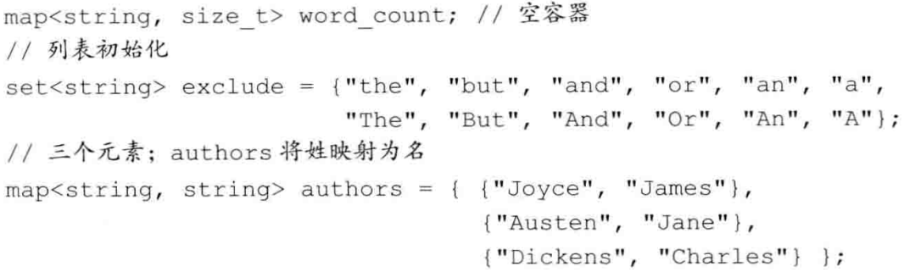
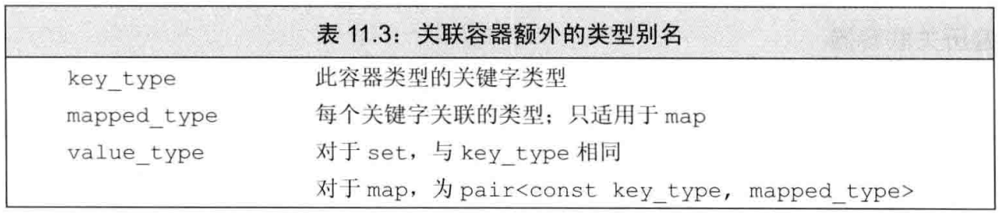

# 第十一章 关联容器
@(Coding)[C++, 笔记, C++ Primer]
```
#include<map>
#include<set>
```


字典:map,索引
想要忽略的集合:set,高效查找

## 11.1 使用关联容器
map, 关键字-值集合, 关联数组
set, 关键字集合

```
map<srting, size_t> word_count;
++word_count[word];
for(const auto &w : word_count){...;}
```
```
set<string> exclude = {..., ..., ...};
if(exclude.find(word) == exclude.end())
	...;
```

## 11.2 关联容器概述
### 11.2.1 定义关联容器
关联容器初始化方式:默认初始化空容器,初始化列表,另一个同类型容器的拷贝,值(能转化即可)范围初始化.

**初始化multimap和multiset**
### 11.2.2 关键字类型的要求

**有序容器的关键字类型**????
**使用关键字类型的比较函数**????

### 11.2.3 pair类型
```
#include<utility>
pair<string, size_t> word_count;	///pair保存两个数据成员.默认 值初始化.
pair<string, string> author{"James", "Joyce"};	///初始化器初始化
```
```
pair<string, string> w;	///数据成员public
w.first;
w.second;
```
pair是map容器的单独元素类型。


列表初始化(初始化器)

**创建pair对象的函数**
如果有一个函数需要返回一个pair,返回列表初始化形式,老版本不允许.
```
std::pair<string, int> process(vector<sring> v)
{
	if(!v.empty())
		return {v.back(), v.back().size()};   列表初始化
	else
		return pair<string, int>();   ///隐式构造返回值????
}
```

## 11.3 关联容器操作
关联容器额外类型:


### 11.3.1 关联容器迭代器
解引用关联容器得到value_type的引用.
set的迭代器是const的,iterator和const_iterater都只能访问.

**遍历关联容器**
按字典序排列遍历.默认迭代器按关键字升序排列

**关联容器和泛型算法**
关联容器的元素不能通过关键字进行快速查找.
关联容器的find比泛型find(顺序搜索)快的多.
在实际编程中,对关联容器使用算法,要么是源序列.要么是目的位置.


### 11.3.2 添加元素
**向map添加元素**
四种方法
```
map<string, size_t> w;
w.insert({word, 1});
w.insert(make_pair(word, 1));
w.insert(pair<string, size_t>(word, 1));
w.insert(map<string, size_t>::value_type(word, 1));
```


不包含重复关键字的关联容器,添加单一元素的insert返回一个pair
multiset或者multimap,添加单一元素的insert返回一个指向新元素的迭代器
```
auto ret = word_count.insert({word, 1});	///旧版本编译器不能用auto,见下行
///pair<map<string, size_t>::iterator ,bool> = word_count.insert(make_pair(word, 1));
```

### 11.3.3 删除元素


### 11.3.4 map的下标操作
map和unordered_map支持下标操作符和at函数
下标运算符:
返回关键字对应的元素
如果关键字不在关联容器内,会创建对应关键字,关联值进行值初始化.(at操作不会这样,会返回out_of_range)
鉴于上,只能对非const的map进行下标操作.


**下标操作的返回值**
vector\string等普通容器,解引用和下标返回的类型是一样的,map的下标返回mapped_type,解引用返回的是value_type

### 11.3.5 访问元素
不允许关键字重复,find和count作用一样；允许关键字重复,count统计元素个数.


允许关键字重复:会有一个复合要求的"列".

**下标和find**
下标:查找+添加
find:查找

**multimap和multiset**
```
string search_item("AAAA");
auto entries = authors.count(search_item);
auto iter = authors.find(search_item);
while(entries){
	cout << iter->second <<endl;
	++iter;   ///????
	--entries;
}
```

**lower_bound和upper_bound**
lower_bound: 第一个给定关键字的元素位置.如果没有该关键字,指向第一个大于该关键字的元素(或尾后迭代器)
upper_bound: 最后一个给定关键字的元素之后位置,如果没有该关键字,指向最后一个小于该关键字的元素之后的位置(或尾后迭代器)
[ower_bound, upper_bound)
如果不在multimap,两者同时返回指向给定关键字的插入点.
不报告关键字是否存在,得到更精确的范围


**equal_range**
lower_bound和upper_bound的实现.

### 11.3.6 一个单词转换的map
待 学习

## 11.4 无序容器

无序关联容器组织元素方式:哈希函数+关键字类型的"=="运算符
顺序关联容器组织元素方式:关键字类型的"<"运算符

无序和有序可以互转
无序容器提供了与有序容器相同的操作,并提供哈希管理操作.
无序容器程序输出与顺序版本不同(非字典序).

关键字类型无序,或者维护序代价高时,使用无序关联容器.
无序关联容器平均性能更好.更简单.

**管理桶**
无序关联容器在存储上组织为一组桶,根据关键字类型Key通过hash映射到某个桶.性能依赖哈希函数的质量和桶的数量和大小.


**无序容器对关键字类型的要求**
==比较元素
`hash<key_type>`  生成每个元素的哈希值.
标准库为内置类型,string,智能指针定义了hash.

使用自定义类类型构建无序关联容器时,必须自定义自己的hash模板版本;
或者提供函数代替==运算符和哈希值计算函数
```
size_t hasher(const Sales_data &sd){
	return hash<string>() (sd.isbn());
}
```
return 后面定义了一个std::hash<std::string>临时变量（第一对圆括号），然后调用该临时变量函数operator()（第二对圆括号，这里是运算符重载），并传sd.isbn()的返回值作为参数。
临时变量的定义语法：
类型(参数列表)


