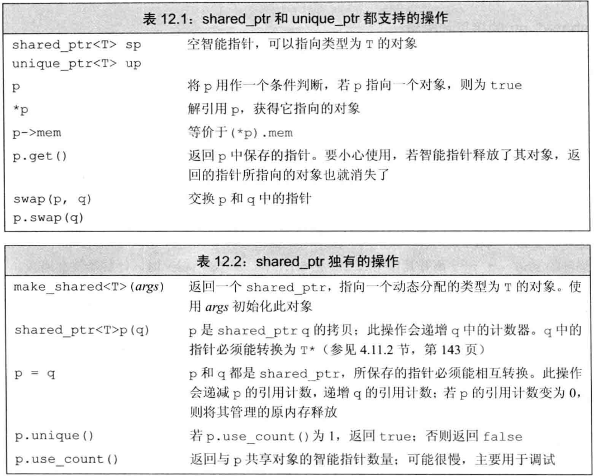

# 第十二章 动态内存
@(Coding)[C++, 笔记, C++ Primer]
静态内存: 局部static变量, 类的static变量, 定义在任何函数之外的变量
栈内存:函数内的非static变量

分配在静态内存和栈内存的对象由编译器自动创建和销毁.栈对象在运行时存在,static对象使用前分配,程序结束时销毁.

每个程序都有一个内存池,叫自由空间或堆.储存程序动态分配的对象.动态对象周期由程序控制,需要显式分配和注销.

## 12.1动态内存和智能指针
**new & delete**
new在东台内存中为对象分配空间并返回一个指向该对象的指针,可以对对象进行初始化.
delete接受一个动态对象的指针,销毁对象,释放与之关联的内存.
动态内存的使用难点:把握正确的销毁时间是困难的.造成非法指针或者内存泄漏.
C++11 两种智能指针, 区别管理底层指针的方式.
`shared_ptr` 允许多个指针指向同一个对象
`unique_ptr` 独占所指对象
`weak_ptr` 伴随类. 一种弱引用,指向shared_ptr所管理的对象.
```
#include<memory>
```

### 12.1.1 shared_ptr类
模板类. 必须提供指针可以指向的类型.
```
shared_ptr<string> p1;	///默认初始化,空指针
shared_ptr<list<int>> p2;
if(p1 & p1->empty())	///解引用方式与一般指针一样.智能指针作为条件,判断智能指针是否为空.
	*p = "hi";
```


**make_shared**
最安全的分配和使用动态内存的方法.
`make_shared` 使用参数**构造**给定类型的对象.
```
shared_ptr<string> p4 = make_shared<string>(10, '9');	///调用string匹配的构造函数
shared_ptr<int> p5 = make_shared<int>();	///所指对象值初始化为0
auto p4 = make_shared<string>(10, '9');	///更便捷
```

**shared_ptr的拷贝和赋值**
每一个shared_ptr都有一个关联的计数器.
被利用到做, +1
被改变, -1
当计数器变为0, 自动释放自己所管理的对象.

**shared_ptr自动销毁所管理的对象**
当指向对象的最后一个shared_ptr被销毁, shared_ptr类会调用其析构函数自动销毁对象.析构函数会递减他所指向对象的引用计数.如果引用计数为0,就会销毁对象并释放内存.
**shared_ptr还会自动释放相关联的内存**
```
shared_ptr<Foo> factory(T arg){
	return make_shared<Foo>arg;
}

void use_factory1(T arg){
	shared_ptr<Foo> p = factory(arg);   ///上层函数销毁时,计数器制0
}

void use_factory2(T arg){
	auto p = factory(arg);   ///此处, auto更简洁, 但可读性差一些
	return p;   ///函数返回的是p的一个拷贝.因此未置0
}
```

shared_ptr在无用后仍保留的一种可能情况: shared_ptr放在一个容器内,随后重排容器,从而不需要某些元素. 此时,需要erase那些不需要的shared_ptr元素.

**使用了动态生存期的资源的类**
程序使用动态内存出于一下三种原因之一:
1. 程序不知道需要多少对象
2. 程序不知道所需对象的类型
3. 程序需要在多个对象间共享数据

### 12.1.2 直接管理内存
new delete
**使用new动态分配和初始化对象**
new无法为其在自用空间分配的对象命名,而是返回一个指向该对象的指针.
```
int *pi = new int;   ///pi指向一个动态分配的,未初始化的无名对象.
```
new的对象是默认初始化的,这意味着内置类型或组合类型的对象的值是未定义的,类类型对象通过默认构造函数进行初始化.

初始化方式:
```
int *pi = new int(1000);	///直接初始化
double *pd = new double();		///后面加空括号,值初始化
string *pstr = new string();	///默认构造函数初始化
string *ps = new string(10, "9");	///构造函数初始化
vector<int> *pv = new vector<int>{1,2,3,4,5};	///列表初始化 
```
如果提供一对括号包围的**初始化器**,可以使用auto从而由编译器推断对象类型. 只有单一初始化器才能使用auto.
```
auto p1 = new auto(obj);
auto p2 = new auto(a, b, c);
```

**动态分配的const对象**
```
const int *pci = new const int(1024);
const string *pcs = new const string;
```
new const变量必须分配和初始化一并完成.对于定义了默认构造函数的类类型,const可以隐式初始化,其他类型的对象必须显式初始化.

**内存耗尽**
此时new失败,抛出bad_alloc.
```
bad_alloc,nothrow@<new>
int *p1 = new int;	///失败抛出bad_alloc
int *p2 = new(nothrow) int;	///失败返回空指针
```
new(arg) 定位new

**释放动态内存**
```
delete p;	///p为动态分配的对象或者空指针
			///销毁指向的对象,并释放内存
```
释放一块并非new分配的内存,或将相同的指针值释放多次, 其行为是未定义的.
编译器无法分辨指针指向静态还是动态对象.,也无法分辨一个只帧所指向的内存是否已经被释放.
const对象的值不能改变,但本身可被销毁.
内置指针管理动态内存需显式释放.

普通指针管理动态内存(new&delete):
1. 忘记delete内存
2. 使用已经释放的对象
3. 同一块内存释放两次

坚持只是用智能指针,可以避免上述问题.在没有智能指针指向的内存,会被智能指针自动释放

空悬指针:指向一块曾经保存数据对象但现在已经无效的内存的指针.

空悬指针与未初始化指针类似.为了避免空悬指针的弊端,
在指针即将要离开作用域之前释放掉他所关联的内存.在delete后,将指针赋nullptr.

### 12.1.3 shared_str和new的结合
new返回的指针初始化shared_ptr:
```
shared_ptr<int> p2 = new int(42);	///错误,shared_ptr接受参数的构造函数是explicit的,不能将普通指针转化成智能指针,必须使用直接初始化.
shared_ptr<int> p2(new int(42));	///正确,直接初始化方式
```
默认情况下,初始化智能指针的指针必须指向动态内存, 智能指针默认是用delete释放所关联的对象.
如果需要将智能指针绑定到一个指向其他类型的资源的指针上,需要提供自己的操作来代替delete


**不混合使用普通指针和动态指针**
shared_ptr可以协调对象的析构,但仅限于其自身的拷贝.避免new的方式导致多个指针绑定同一块内存.
```
void process(shared_ptr<int> ptr);	//值传递,即发生了拷贝.
```
**也不要使用get初始化另一个智能指针或者赋值**
get()返回一个内置指针,为了方便不能使用智能指针的代码使用.使用get返回的指针代码不能"delete"此指针.
```
shared_ptr<int> p(new int(42));
int *q = p.get();	///不能使q被管理的内存被释放
{///新程序块
	shared_ptr<int>(q);
}	///q被销毁,内存被释放.
int f = *q;
```

get用来将指针的访问权限传递给代码, 只有在确定代码不会delete指针的情况下才能使用get.
特别的,永远不要使用get初始化另一个智能指针或者为智能指针赋值.

**其他shared_ptr操作**
```
shared_ptr<int> p = make_shared<int>(24);
p = new int(1024);	///错误.
p.reset(new int(1024));	///正确,更新计数器
```
reset多与unique联用:
```
if(!q.unique())
	p.reset(new string(*p));   ///p不是该动态内存的唯一用户,不能贸然改变其值.
							   ///如果需要在此处修改,必须重新分配拷贝.
*p += newVal;	///对于唯一用户的动态指针,能够修改所指内容.
```


### 12.1.4 智能指针和异常
使用智能指针,在程序块正常结束或者出现异常后资源能被正确释放.
**智能指针和哑类**
对于没有析构函数的类,在忘记或者异常退出时,无法释放内存,造成内存泄漏.
使用管理动态内存类似的技术, 管理不具有良好定义析构函数的类
```
void end_connection(connection *p){disconnect(*p);}
void f(destination &d){
	connection c = vonnect(&d);
	shared_ptr<connection> p(&c, end_connection);   ///当f退出时,connection被正确关闭
}
```

智能指针陷阱
1. 相同的内置指针值初始化（或reset）多个智能指针    //多个智能指针还是单独的指向内置指针的内存，use_count分别为1
2. 不delete get( )返回的指针                                                           //两次delete释放,智能指针内部也会delete
3. 不使用get( )初始化或reset另一个智能指针                               //free( ): invalid pointer:也是多次释放
4. 如果你使用get( )返回的指针，记住当最后一个对应的智能指针销毁后，你的指针就变得无效了
5. 如果你使用智能指针管理的资源不是new分配的内存，记住传递给它一个删除器（删除函数向上面的disconnect( )）。

### 12.1.5 unique_ptr


没有类似make_shared<>的函数
**不支持普通的赋值和拷贝**. 必须采用直接初始化,可以绑定new返回的指针, 也可以不带参数,绑定空unique_ptr指针.
```
unique_ptr<double> p1;	///unique_ptr空指针,可以绑定double类型对象
unique_ptr<string> p2(new string("TJPU"));
```
可以通过release和reset将指针的所有权从一个(非const)unique_ptr转移给另一个unique_ptr.
```
p2.reset(p1.release());
auto p3 = p1.release();	///需delete
```
**传递unique_ptr参数和返回unique_ptr**
不能拷贝unique_ptr的规则例外:可以拷贝和赋值一个将要被销毁的unique_ptr.
从函数返回一个unique_str:
```
unique_ptr<int> f1(int p){
	return unique_ptr<int>(new int(p));
}
```
或返回一个局部对象的拷贝:
```
unique_ptr<int> f2(int p){
	unique_ptr<int> ret(new int(p));
	...
	return ret;
}
```
这是一种"特殊的拷贝"

! 向后兼容auto_ptr
早期版本auto_ptr.具有unique_ptr部分特性.不能在容器保存auto_ptr,也不能函数返回auto_ptr
C++11仍保留auto_ptr,但应该写unique_ptr.

! `decltype(end_connection)`返回函数类型, `decltype(end_connection) *` 指针类型

### 12.1.6 weak_ptr
不计数的shared_ptr, 不掌控shared_ptr的销毁与释放.


使用shared_ptr初始化weak_ptr
```
auto p = make_shared_shared<int>(42);
weak_ptr<int> wp(p);	///指向同一个对象
wp = p;	///指向同一个对象
```

作用:伴随指针(类)


## 12.2 动态数组
new和delete只能处理一个对象.
C++: new数组, 分配并初始化一个对象数组
标准库: allocator,分配和初始化分离. 有更好的性能和更灵活的内存管理.

### 12.2.1 new和数组
动态数组:
```
int *ip = new int[get_size()];   ///方括号内必须是整型,但不必是常量
```
类型别名形式:
```
typedef int arrT[42];
int *ip = new arrT;
```
**分配动态数组得到一个元素类型的指针**
new分配动态数组,返回的并非数组类型的对象,而是一个数组元素类型的指针.
不能使用[num], begin, end, 范围for. 使用数组维度来返回指向首元素和尾后元素的指针.
不能auto.

**初始化动态分配对象的数组**
```
int *pia = new int[10];	///默认初始化
int *pia2 = new int[10]();	///值初始化 0
string * psa = new string[10];	///默认初始化,调用默认构造函数,10个空字符串
string * psa2 = new string[10]();	///十个空字符串
```
```
int *pia3 = new int[10]{1,2,3,4,5,6,7,8,9,0};	///使用初始化器的列表初始化
string *psa3 = new string[41]{"a", "an", "the", string(3, 'x')};	///部分列表初始化,未显式初始化的元素进行元素初始化.
string *psa3 = new string[41]("a", "an", "the", string(3, 'x'));	///错误.
```
当初始化列表元素数目大于动态数组元素个数, new表达式失败, 返回bad_array_new_length(@new.h), 不分配内存.

可以用空括号初始化动态数组, 但括号内给出初始化器, 这意味着不能用auto分配数组.

**动态分配一个空数组是合法的**
```
size_t n = 0;
int *p = new int[n];
for(int *q = p；q != p + n；++q)
	...
```
new一个0长度的数组,new返回一个合法的非空数组,该指针作用类似尾后指针.

**释放动态数组**
```
delete p;	///释放动态对象或空
delete [] pa;	///释放动态数组或空
typedef int arrT[42];
auto p2 = new arrT;
delete [] p; ///释放42大小的动态数组
```

**智能指针与动态数组**
利用智能数组管理动态数组:
```
unique_ptr<int[]> up(new int[42]);
up.release();	///自动用delete[]销毁
```
指向数组的unique_ptr用法略有不同:


shared_ptr不能直接管理动态数组,可以通过自定义删除器的方式实现.
```
shared_ptr<int> sp(new int(10), [](int *p){delete [] p;});
sp.reset();	///使用lambda中的delete []删除.
```
shared_ptr未定义下标运算符, 智能指针也未定义指针算术运算:
```
for(size_t i = 0; i != 10; ++i)
	*(sp.get() + i) = i;   ///使用get取得内置指针.
```

### 12.2.2 allocator类
new 内存分配和对象构造一起执行
delete 对象析构和内存释放一起执行
这样在某些情况下会导致不必要的浪费.
**allocator**

@memory.h
allocator类将内存分配和对象构造分离开来.它提供一种类型感知的内存分配方法, 分配的内存是原始的,未构造的.
allocator也是模板类
```
allocator<string> alloc;	///可分配string的allocator对象
auto const p = alloc.allocate(n);	///分配n个未初始化的string
```
**allocator 分配未构造的内存**
construct成员函数接受一个指针和若干额外参数, 在给定位置构造一个元素,类似make_shared.
```
auto q = p;
alloc.construct(q++);	///空字符串
alloc.construct(q++, 10, 'c');	///十个c
alloc.construct(q++, "hi");	///hi
```
```
while(q != p)
	alloc.destory(--q);///调用析构函数销毁对象
alloc.deallocator(p, n);	///释放内存
```
**拷贝和填充未初始化内存的算法**
在未初始化内存中创建对象,两个伴随算法@memory.h:


```
auto p = alloc.allocator(vi.size() * 2);
auto q = uninitialized_copy(vi.begin(), vi.end(), p);	///vi拷贝到p代表的内存内,返回最后一个构造的元素的下一个位置.
uninitialized_fill_n(q, vi.size(), 42);
```


## 12.3 使用标准库:文本查询程序
