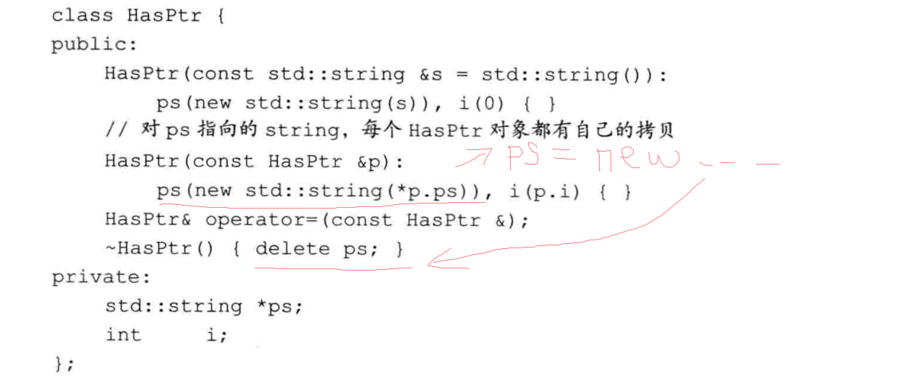
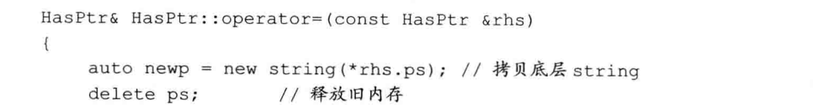
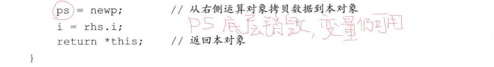
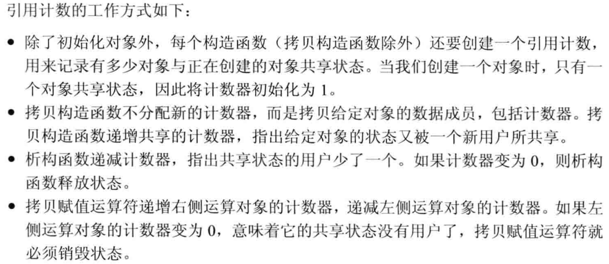
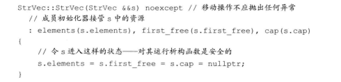
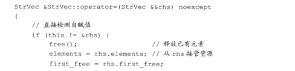
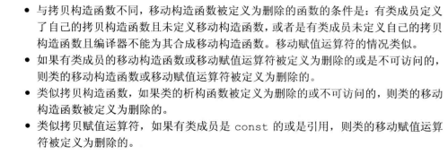

# 第十三章 拷贝控制
@(Coding)[C++, 笔记, C++ Primer]
类的拷贝控制操作由拷贝构造运算符,拷贝赋值运算符,移动构造运算符,移动赋值运算符和析构函数.
## 13.1 拷贝 赋值与销毁
### 13.1.1 拷贝构造函数
拷贝构造函数的第一个参数是自身类型的引用(如果不引用会造成反复调用,完不成拷贝赋值), 其它参数均有默认值.

**合成拷贝构造函数**
对某些类,合成拷贝构造函数被用来阻止我们拷贝该类类型的对象.
一般来说,合成拷贝构造函数将参数的成员逐个逐元素拷贝到正在创建的对象中.拷贝方式:
类类型使用拷贝构造函数, 内置类型直接拷贝.数组类型不能拷贝,进行逐元素拷贝成员;类类型数组,则逐元素调用拷贝构造函数进行拷贝.
可以看为有唯一引用参数的带有初始化列表的空函数体构造函数.
```
Sales_data::Sales_data
```
**拷贝初始化**
```
string dots(10, '.');	///直接初始化
string s(dots);	///直接初始化
string s2 = dots;	拷贝初始化
string null_book = "9-999-9999-99";	///拷贝初始化
string nines = string(9, 't');	///拷贝初始化 
```
直接初始化:使用普通的函数匹配
拷贝初始化: 将右侧对象拷贝到正在创建的对象中,可能发生类型转换.

如果类有移动构造函数,可能不使用拷贝构造函数而使用移动构造函数完成拷贝初始化.

拷贝初始化在"="之外的发生:
1. 传递给非引用形参
2. 返回非引用返回值
3. {}初始化一个数组的元素或聚合类的成员
4. 容器调用insert或push等.类类型还会对它们所分配的对象使用拷贝初始化.

**拷贝初始化的限制**
初始化值要求explicit构造函数来进行类型转换时,拷贝初始化要符合要求.
```
void f(vector<int>);
f(10);
f(vector<int>(10));
```
```
string null_book = "9-999-9999-99";	///拷贝初始化
string null_book("9-999-9999-99");	///编译器略过了拷贝构造函数,但此时拷贝/移动函数也必须是存在且正常访问的.(比如非private)
```

### 13.1.2 拷贝赋值运算符
**重载赋值运算符**
本质函数
```
T& operator=( T& );
```
某些运算符,包括赋值运算符,必须定义为成员函数.定义为成员函数,其左侧运算对象就绑定到隐式的this指针,
赋值运算符通常返回一个指向其左侧运算对象的引用.

**合成拷贝赋值运算符**
1. 禁止该对象的赋值
2. 将右侧运算对象的每个非static成员赋予左侧运算对象的对应成员.数组采用逐元素赋值方法.

### 13.1.3 析构函数
析构函数释放对象使用的资源, 并销毁对象的非static数据成员.
```
class Foo{
public:
	~Foo();
}
```
类名前~,没有返回类型,不接受参数.不能被重载,只有唯一一个.

**析构函数如何工作**
析构函数释放对象生存期分配的所有资源.首先执行函数体,然后销毁成员,成员销毁顺序与初始化顺序相反.
析构部分是隐式,隐式销毁一个指针成员,不会delete所指对象.

对象的指针或引用离开作用域,析构函数不会执行.

**合成析构函数**
阻止对象销毁, 如果不是这个目的,则函数体为空

析构函数体并不直接销毁成员,成员在析构函数体之后隐含的析构阶段中被注销的.

### 13.1.4 三/五法则
需要析构函数的类,也需要拷贝和赋值操作.
默认的简单拷贝(浅拷贝)在合成拷贝赋值函数中使用,只是简单的将指针值传递.P447
需要拷贝操作的类也需要赋值操作,反之亦然.

### 使用 =default
在拷贝控制成员(或默认构造函数)定义为=default来显式要求使用合成版本,其他版本构造函数不能使用.
在类内使用, 隐式声明为内联.
在类外使用,普通函数
```
Sales_data() = default;
```

### 13.1.6 阻止拷贝
**删除函数**
阻止拷贝或赋值
```
Nocopy(const Nocopy&) = delete;
Nocopy& operator=(const Nocopy&) = delete;
```
=delete可以被任意函数使用, 被用来引导函数匹配.

**析构函数不能= delete**
对析构函数= delete,编译器不允许定义相应变量或者临时变量. 面对这种情况,一个类对象作为另一个类类型成员时,后者也不能定义相应变量或者临时变量.

**合成的拷贝控制成员可能是删除的**
如果一个类的数据成员不能默认构造/拷贝/复制或销毁,则对应的成员函数被定义为删除的. 见p450
1. 
2. 
3. 
4. 
**private拷贝控制**
在C++11之前阻止拷贝控制的用法.

## 13.2 拷贝控制和资源管理
管理类外资源的类必须定义拷贝控制成员.
两种拷贝语义:
1. 类值的行为. 底层数据也需重建
2. 类指针的行为.共享底层数据
3. IO和unique_str既不像值又不像指针

### 13.2.1 行为像值的类
每个对象都有一份自己的拷贝: 从底层重建拷贝


**类值拷贝赋值运算符**
需要定义拷贝构造函数/析构函数/拷贝赋值函数


**赋值运算符**
1. 将对象赋给自己本身,赋值必须能正常进行.
2. 大多数赋值运算符组合了析构函数和拷贝构造函数的工作.

顺序执行/异常安全:先向右侧拷贝赋值,再释放左侧资源,并**更新指针**

**定义行为像指针的类**
需定义拷贝构造函数和拷贝赋值函数和析构函数.
两种管理资源的方法:
1. shared_ptr自动管理资源
2. 引用计数直接管理资源

**引用计数**


计数器需保存在动态内存中.

```
class c{
public:
	//构造函数分配新的string和新的计数器
	HasPtr(const std::string &s = std::string()): 
	ps(new std::string(s)), i(0), use(new std::size_t(1)) {}
	///拷贝构造函数,完成拷贝,并递增计数器
	HasPtr(const HasPtr &p): ps(p.ps), i(p.i), use(p.use) {
		++*use;
	}
	///拷贝赋值运算符
	HasPtr& operator=(const HasPtr&);
	~HasPtr();
private:
	std::size_t *use;	///在类内初始化列表初始化
};

HasPtr::~HasPtr(){
	if(--*use == 0){
		delete ps;
		delete use;
	}
}

HasPtr::HasPtr& operator=(const HasPtr& rhs){
	++*rhs.use;
	if(--*use == 0){
		delete ps;
		delete use;
	}
	ps = rhs.ps;
	i = rhs.i;
	use = rhs.use;
	return *this;
}
```

## 13.3 交换操作
管理资源类常用函数:swap函数. 类优先使用自定义swap, 否则使用标准库的swap.
```
HasPtr temp = v1;	///-1 +1
v1 = v2;	//-1 +1
v2 = temp;	//-1 +1 计数器未改变
```
```
class HasPtr{
friend void swap(HasPtr&, HasPtr&);	///友元函数,保证能访问HasPtr所有成员
};
inline void swap(HasPtr& lhs, HasPtr& rhs){	///内联函数,优化代码
	using std::swap;
	swap(lhs.ps, rhs.ps);
	swap(lhs.i, rhs.i);
	///计数器不用交换,原因见上一端代码
}
```

**swap函数应该调用swap,而不是std::swap**
```
class Foo{
	friend void swap(Foo&, Foo&);
...
private:
	HasPtr h;
...
};
inline Foo::void swap(Foo& f1, Foo& f2){
	std::swap(f1.h, f2.h);   ///错误,应调用HasPtr的swap
}

inline Foo::void swap(Foo& f1, Foo& f2){
	using std::swap;   ///为何正确工作,p706 18.2.3
	swap(f1.h, f2.h);   ///正确,调用了HasPtr的swap
}
```
每个swap都应该是未限定的. 如果存在类型特定的swap,其匹配度会优于std中定义的版本.

**在赋值运算符中使用swap**
```
HasPtr::HasPtr& operator=(HasPtr rhs){
	swap(*this, rhs);
	return *this;
}
```
注意形参非引用版本,拷贝并交换的技术保证了异常安全.
这样处理,使得类可能抛出异常的就是拷贝构造函数中的new表达式.

## 13.4 拷贝控制实例(待读)

## 13.5 动态内存管理类(待读)
C++11 STL
移动构造函数
move标准库函数,在使用move时,直接调用std::move而不是move

## 13.6 对象移动
在对象拷贝后立即销毁的对象,使用移动构造函数提升新能
IO类,unique_ptr类,这些不能被共享的资源不能拷贝但可以移动.

### 右值引用
必须绑定到右值的引用. 符号&&. 只能绑定到一个将要销毁的对象.
一个左值表达式表示的是一个对象的身份;一个右值表达式表示的是对象的值.
左值不能绑定到要求转换的表达式, 字面常量或返回右值的表达式.右值能.

```
int i = 42;
int &r = i;	///正确
int &&rr = i;	///错误
int &r2 = i * 42;	///错误
const int &r3 = i * 42;	///正确.允许将一个const的引用绑定到一个右值.
int &&rr2 = i * 42;	///正确
```

左值: 返回引用的函数 赋值 下标 将解引用 前置递增递减运算符 变量(变量表达式). 左值引用绑定
右值:返回非引用的函数 算术 关系 位运算符 后置递增递减运算符. const左值引用或右值引用.

右值引用只能绑定到临时对象:
- 可引用对象即将被销毁
- 该对象没有其他用户

**标准库move函数**
C++11 move标准库函数显式的将一个左值转化为对象的右值引用.获得绑定到左值上的右值引用.
```
#include<utility>
int &&rr3 = std::move(rr1);		///显式将一个左值转化为对应的右值引用.
```
除了对rr1赋值或销毁外,我们不能再使用它.必须使用std::move,不能使用using声明.
可以销毁一个移后源对象,也可以赋予它新值,但不能使用一个移后源对象的值.

### 13.6.2 移动构造函数和移动赋值运算符


移动构造函数的第一个参数类型是右值引用, 额外的参数必须有默认实参
移动构造函数完成资源移动后,必须保证移后源对象销毁无害.

**移动操作, 标准库和异常**
移动操作要求不抛出异常.使用noexcept关键字.

noexcept关键字:
C++11,出现在形参列表和初始化列表的冒号之间,必须在声明和定义都指定.
在使用移动构造函数时,必须保证移动构造函数不会有异常,否则必须用拷贝构造函数.

**移动赋值运算符**
noexcept的；必须能够处理自赋值



**移后源对象必须可析构**
保证两点:析构安全, 赋予nullptr来实现; 对象有效, 可赋新值, 程序不依赖前值使用.

**合成的移动操作**
如果类自定义了拷贝构造函数,拷贝赋值函数和析构函数,不会合成移动操作.
一个类没有移动操作,会通过正常的函数匹配,使用对应的拷贝操作来代替.

只有当类没有自己版本的拷贝控制成员,且每个非static成员都可以移动,才会合成默认的移动构造函数和移动赋值运算符.
特别的, 如果一个类是类类型, 且该类有对应的移动操作, 才能合成移动操作.

移动操作永远不会被隐式的定义为删除的函数. 但定义移动操作为=default,且编译器不能移动所有成员,则编译器将移动操作定义为删除的函数.



如果类定义了一个移动构造函数和\或移动赋值运算符,则其合成的拷贝构造函数和拷贝赋值函数是删除的函数.

**移动右值,拷贝左值.**
拷贝构造函数可以接收左值和右值. 右值调用拷贝构造函数需要进行一次const转换, 移动构造函数是精准匹配.
移动构造函数只能接收右值.
如果定义了拷贝构造函数没有移动构造函数,根据函数匹配规则,会调用拷贝构造函数(该调用是安全的),即使std::move()也会调用.

**拷贝并交换赋值运算符和移动操作**
拷贝并交换赋值运算符根据形参类型选择拷贝赋值运算符还是移动赋值运算符,完成不同的移动赋值操作.

**移动迭代器**
解引用移动迭代器得到一个右值引用,进而使用移动构造函数.
make_move_iterator,将普通迭代器变为移动迭代器.

STL不保证移动迭代器的使用范围, 需用户自己确定在移动赋值后不再访问.

### 13.6.3 右值引用和成员函数
为类成员函数提供拷贝(const X&)和移动版本(X&&),拷贝版本能"复制"数据, 移动版本能"窃取数据"

**右值或左值成员函数**
C++11允许右值赋值和操作.
```
string s1 = "XIXI", s2 = "HAHA";
auto n = (s1 + s2).find('A');
```
```
s1 + s2 = "wow!";
```
引用限定符(& or &&)在参数列表后面可以指出this的左值/右值属性的方式.
引用限定符可以是&或&&,分别指出this可以指向一个左值或者右值, 只能应用于非static成员函数,并且同时出现在声明和定义中.
```
class Foo{
public:
	Foo &operator=(const Foo&) &;
};
```
```
Foo &Foo::operator=(const Foo& rhs) &{
	return *this;
}
```
const 和 引用限定符联合使用,必须const在前, 引用限定在后:
```
class Foo{
	Foo anmen() & const;   ///错误
	Foo anothermen() const &;   ///正确
};
```

**重载和引用函数**
引用限定符何以和const一样来区分重载版本,也可以联合使用.
如果两个成员函数同名且同形参列表,如果一个使用引用限定符,另一个也必须使用. 要么同时加,要么同时不加.
```
class Foo{
public:
	Foo sorted() &&;
	Foo sorted() const;   ///错误,应为Foo sorted() const &;
	
	Foo sorted(Comp*) &&;   ///正确,形参列表不同
	Foo sorted(Comp) const &;   ///正确,两个版本都有限定符
};
```
