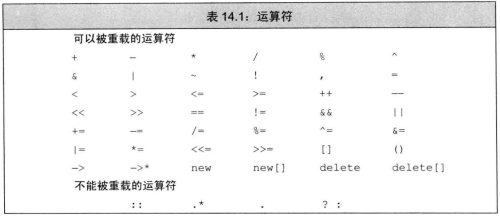
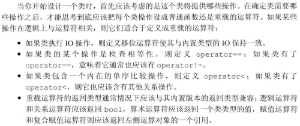
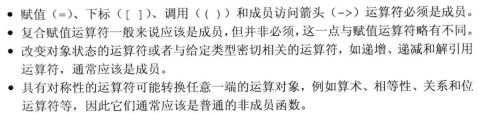

# 第十四章 重载运算和类型转换
@(Coding)[C++, 笔记, C++ Primer]
14.1 基本概念
重载的运算符,实际是一个函数:
```
返回类型 operator运算符(形参...);
```
如果重载的运算符是类成员,那么第一个(左侧)运算对象绑定到隐式的this指针上.

对运算符函数而言:要么是类成员,要么至少含有一个类类型参数.

可以重载大部分运算符, 能重载的运算符也不不适合重载的.
`+ - * &`既是一元运算符又是二元运算符, 根据参数数量判断.
对于重载的运算符,其优先级和结合律与对应的内置运算符保持一致. 例如
```
x == y + z;   ///等价与下式
x == (y + z);
```


`.*`成员指针运算符在指针运算符的基础上限定了变量的适用范围是类或结构体的成员变量或成员函数指针.
重载版本的操作函数无法保留求值顺序(逻辑与,逻辑或,逗号运算符)和/或短路求值属性(&&,II),不建议重载
逗号和取地址运算符在类类型对象有特殊含义,即"类内置含义", 不应该被重载


**直接调用一个重载的运算符函数**
```
data1 + data2;   ///等价于
operator(data1, data2);
```

**使用于内置类型一致的含义**

内置的运算符和重载的运算符逻辑上映射,重载的运算符效果最好.

如果类含有算术运算符或者位运算符,最好提供对应的复合赋值运算符.

**选择作为成员和非成员**

```
选择作为成员函数还是非成员函数
成员函数：
=，[ ]，( )， ->，
符合赋值+=,-=..  ，
++，--，*(解引用) 改变对象的状态或与给定类型密切相关的运算符
非成员函数：多为对称型的运算符
算数+，-，*，/...
相等性== ，!=
关系 >,<,>=,<=..
位运算符 ^, |, &
```

提供类对象的混合类型表达式,必须定义成非成员函数.
定义运算符为成员函数时,他的左侧对象一定要是运算符所属类的一个对象.

```
string s = "world";
string t = s + "!";		///正确
string u = "hi" + t;	///如果+为string的成员函数,错误
```
如果operator+是string成员函数. `"hi" + t`等价与`"hi".operator+(t)` `"hi"`为`const char*`类型,没有成员函数
实际上operator+为非成员函数,`"hi" + t`等价与`operator+("hi", t)`.

## 14.2 输入和输出运算符
### 14.2.1 重载输出运算符<<
```C++
ostream &operator<<(ostream &os, const Sales_data &item){
	os << item.isbn() << " " << item.units_sold << " " << item.revenue << " " << item.avg_price();
	return os;
}
```
输出运算符尽量减少格式化操作,特别是endl.

重载的输出运算符的左侧是ostream, 因此应为**非成员函数**,且需读写私有成员数据, 因此应为**友元函数**

### 14.2.2 重载输入运算符>>
输入运算符和输出运算符格式上**类似**，也是非成员函数，返回输入流引用（流不能拷贝），参数是输入流引用和类对象
和输出运算符不同的是，**输入运算符必须处理输入可能失败的情况，而输出运算符不需要**。
当流含有错误类型的数据时读取操作可能失败，读取数据到文件末尾或遇到其他流错误也会失败。
**不需要逐个检查，只在末尾检查即可，当读取操作发生错误时，输入运算符应该负责从错误中恢复。** 
一些输入运算符可能需要更多的数据验证工作。
```C++
istream &operator>>(istream &is, const Sales_data &item){
	double price;
	is >> item.bookNo >> item.units_sold >> price;
	if(is)   ///输入完毕的错误检查
		item.revenue = item.units_sold * price;
	else   ///输入错误会重置对象状态
		item = Sales_data(); 
	return is;
}
```

## 14.3算术和关系运算符
两者均为**非成员函数**. 左侧和右侧交换在逻辑上不同定义为非成员函数
没有对对象更改,**常量的引用**

算术运算符运算后得到一个新值, 操作完成返回新值的副本. 定义了算术运算符,一般也要定义复合赋值运算符.

### 14.3.1 相等运算符
依次比较每个成员是否相等。
如果类定义了operator==,那么类也应该定义operator!=。
相等运算符和不相等运算符中的一个应该把工作委托给另外一个。
如果某个类逻辑上有相等性的含义，则该类应该定义`operator==`,这样做可以使得用户更加容易的使用标准库算法（部分标准库算法必须要有`==`支持）
比较智能指针问题
shared_ptr 和 unique_ptr 都用get( )返回的指针来比较是否指向同一个对象
weak_ptr 要先使用lock( )获取shared_ptr 然后在用get( )来比较地址从而判定是否指向同一个对象。

### 14.3.2 关系运算符
定义了相等运算符的类通常也应该定义关系运算符，因为关联容器和一些算法要用到小于运算符。所以operator<会比较有用。

如果存在唯一一种逻辑可靠的<定义，则应该为这个类定义<运算符，如果类同时还包含`==`，则当且仅当`<`的定义和`==`产生的结果一致时才定义<运算符。`P498 ???? 两个互补小于或者互不大于,即为相等,与自定义的相等运算符相悖`


不要轻易定义<运算符，如果<和==比较的逻辑相同（也就是比较的成员相同）才定义<运算符。
注意：一些情况我们必须定义<运算符，比如类对象需要存在map或set等关联容器中的时候等等。

## 14.4 赋值运算符
类还可以定义其他赋值运算符以使用别的类型作为右侧运算对象。
和拷贝赋值运算符及移动赋值运算符一样，其他重载的赋值运算符也必须先释放当前内存空间，不同之处是无需检查自赋值。
我们可以重载赋值运算符。不论形参的类型是什么，赋值运算符都必须定义为成员函数。
**复合赋值运算符**
复合赋值运算符不非得是类的成员，不过我们还是倾向于把包括复合赋值在内的所有赋值运算符都定义在类的内部。
为了与内置类型的复合赋值保持一直，类中的复合赋值运算符也要返回其左侧运算对象的引用。
赋值运算符必须定义成类的成员，复合赋值运算符通常也应该这样做，这两类运算符都应该返回对象的引用。

## 14.5 下标运算符
表示容器的类通常可以通过元素在容器中的位置访问元素，这些类一般会定义下标运算符operator[ ]。
下标运算符必须是成员函数。
下标运算符通常以所访问元素的引用作为返回值。可以作为左值或右值
我们最好同时定义下标运算符的常量版本和非常量版本，当作用于一个常量对象时，下标运算符返回常量引用以确保我们不会修改返回值。
如果一个类包含下标运算符，则它通常会有两个版本：一个返回普通引用，另一个是类的常量成员并返回常量引用。

## 14.6 递增和递减运算符
定义递增和递减运算符的类应该同时定义前置版本和后置版本。这些运算符应该被定义为类的**成员函数**。
为了与内置版本保持一致，前置运算符应该返回递增或递减后对象的引用。
区分前置运算符和后置运算符：后置版本提供一个额外的不被使用的int类型的参数，使用后置运算符时，编译器为这个形参提供一个值为0的实参。这个形参的唯一作用就是区分前置版本和后置版本。

为了与内置版本保持一致，后置运算符应该返回对象的原值（递增或递减之前的值），返回的形式是一个值而非一个引用。对于后置版本来说，在递增或递减之前首先需要记录对象的状态。

后置版本里可以调用前置版本,因此在设计类的时候先定义前置++--。
前置版本在递增之前要判断是否到达末尾，前置版本递减要在递减之后判断是否超出开头。
如果我们要通过函数调用的方式调用后置版本，则必须为他整型参数传递一个值，尽管我们不使用这个值。

## 14.7 成员访问运算符
解引用运算符检查是否在范围内，然后返回所指元素的一个引用，箭头运算符不执行任何自己的操作，而是调用解引用运算符并返回解引用结果的地址。
箭头运算符**必须是类的成员**，解引用运算符**通常也是类的成员**，尽管并非必须如此。都是**const函数**,**返回非常量的引用**.
重载的箭头运算符必须返回类的指针**或者自定义了箭头运算符的某个类的对象**。

## 14.8 函数调用运算符

## 14.9 重载,类型转换和运算符
