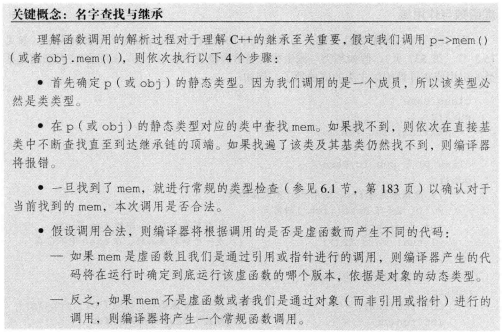

# 第十五章 面向对象程序设计
@(Coding)[C++, 笔记, C++ Primer]
## 15.1 OPP:概述
面向对象设计核心思想:数据抽象, 继承 和 动态绑定

数据抽象:类的实现和接口分离
继承:定义相似类型并对其相似关系建模.
动态绑定(多态):在一定程度上忽略相似类型的区别,以统一的方式使用它们建立对象.

**继承**: 联系在一起的类构成的一种层次关系.
层次的根部:基类, 直接或间接从基类继承的类:派生类.基类负责定义在层次关系中所有类共有的成员.派生类定义各自特有的成员.

**虚函数** 基类希望派生类分别定义自身版本
**派生类列表** 冒号 + 逗号分割的基类列表, 基类列表允许加访问说明符(public,protected,private等)
**override** C++11 派生类显式注明使用哪个成员函数改写基类.
**运行时绑定** = **动态绑定** 函数的版本由实参决定,即在运行时选择函数的版本.

## 15.2 定义基类和派生类
### 15.2.1 定义基类
```
#include<iostream>
#include<string>
using namespace std;
class Quota{
public:
    Quota() = default;
    Quota(const string &book, double sales_price) :
        bookNo(book), price(sales_price){}
    virtual double net_price(size_t n) const{
        return n*price;
    }
    virtual ~Quota() = default;//基类通常都应该定义一个虚析构函数，即使该函数不执行任何实际操作也是如此
private:
    string bookNo;
protected:
    double price = 0.0;
};
```
**覆盖override** 派生类需要覆盖基类中跟类型有关的定义

基类的两种成员:希望派生类覆盖的成员函数(虚函数)；希望派生类直接继承的成员函数.
使用指针或引用调用虚函数,该调用被动态绑定.

在基类成员函数声明前加`virtual`关键字,即可执行动态绑定. **任何构造函数之外的非静态函数**都可以声明为虚函数.虚函数的`virtual`关键字只能出现在类内声明语句之前不能用于类外的定义. 在基类定义为虚函数, 派生类覆盖的函数隐式的被定义为虚函数.

非虚函数解析过程在编译时, 虚函数在运行时.

派生类可访问基类的publlic成员和protected成员, 不能访问private成员.
protected成员的访问权限:没有继承关系的类等同于private, 有继承关系的类能被派生类访问, 但不能被其他没有关系的类访问.

### 15.2.2 定义派生类
```
class Bulk_quota : public Quota{
public:
    Bulk_quota() = default;
    Bulk_quota(const string&, double, size_t, double);
    double net_price(size_t)const override;
private:
    size_t min_qty = 0;
    double discount = 0.0;
};
```
如果一个派生是共有或protected的,则基类的共有成员和protected成员也是派生类接口的组成部分.我们可以将共有(或protected)派生类型对象绑定到基类的引用和指针上.
**单继承**
**派生类中的虚函数**
派生类经常(非总是)覆盖基类中的虚函数.如果派生类没有覆盖虚函数, 则会继承它
派生类可以在发生覆盖行为的函数前加virtual关键字,但非必须.C++11允许显式注明它使用某个成员函数覆盖了他的虚函数.具体做法是在形参列表后面,或者const成员函数的const关键字后面加override关键字.

**派生类对象以及派生类向基类的类型转换**
派生类对象包含多个组成部分:派生类自己定义的非静态成员的子对象; 和对应基类的子对象,可以有多个.两部分可能是非连续空间储存的.
**派生类向基类的类型转换** 派生类对象含有基类对应的组成部分,所以能够把派生类对象当作基类对象使用, 也能将派生类对象(的基类部分)绑定到基类的引用或指针上.这个过程是**隐式**的

**派生类构造函数**
每个类控制自己部分的初始化过程. 派生类调用基类的构造函数初始化基类部分子对象, 然后按照声明顺序依次初始化派生类成员.
默认情况,派生类对象的基类部分执行基类的默认初始化, 如果想使用其他的基类构造函数, 需要以类名加圆括号内的实参列表的形式为构造函数提供初始值.

**派生类使用基类的成员**
派生类可以访问基类的公有成员和受保护成员.
派生类的作用域嵌套在基类的作用域中. 对于派生类的一个成员, 它使用派生类成员的方式和使用基类可访问成员的方式一致.
每个类负责定义各自的接口.想要与类的对象交互必须使用该类的接口,即使派生类对象使用其基类部分也是如此.
派生类对象不能直接初始化基类成员.虽然在语法上可以在派生类构造函数体内为基类公有或受保护成员赋值,但最好不这么做.

**继承与静态成员**
基类定义的静态成员, 在整个继承体系中存在该成员的唯一定义.
类的静态成员遵循一般的访问规则.

**派生类的声明**
```
class bulk_quote : public Quote;	///错误
class bulk_quote;
```

**被作为基类的类**
作为基类的类, 必须是定义过的类.
一个类可以既是基类,又是派生类. **直接基类****间接基类** 派生类既包含直接基类子对象又包含间接基类子对象.

**防止继承的发生**
在类名后,加"final"关键字
```
class NoDerived final { };
```

### 15.2.3 类型转换和继承
如果想把指针或引用绑定到对象, 指针或引用的类型必须和对象的类型一致, 或者对象的类型有一个可接受的const类型转换规则, 或者将基类的指针或者引用绑定到派生类对象上.(**向下绑定&向上转换**)
```
class base {};
class derive : public base {};
derive d;
base *pb = &d;	///正确
base &b = d;	///正确
```
智能指针类可以将一个派生对象的指针存储在一个基类的智能指针内.

**静态类型和动态类型**
存在继承关系的类型中, 静态类型就是在编译时已知,是变量声明的类型或者表达式生成的类型；动态类型是变量和表达式在内存中的对象的类型, 在运行时才能被知晓.
如果表达式不是引用或指针,那么静态类型和动态类型永远一致.
静态类型就是字面意义的的类型, 动态类型就是实际的类型.

**不存在从基类向派生类的隐式类型转换**
基类对象可以独立存在, 也尅以当作派生类对象的一部分存在, 因此可惜实现派生类对象向基类对象的隐式转换.
一个基类对象可能是派生类对象的一部分,也可能不是,所以不存在从基类向派生类的自动转换.

一个基类指针或者引用绑定到一个派生类对象上,也不能完成基类向派生类的转换. 编译器只能通过静态类型来推断转换是否合法, 无法确定某个特定的转换在运行时是否合法.
如果一个基类含有一个或多个虚函数,使用`dynamic_cast`请求转换, 该转换的安全检查在运行时执行.如果确定基类向派生类的转换是安全的, 使用`static_cast`强制覆盖掉编译器的检查工作.

**在对象之间不存在类型转换**
派生类向基类的自动转换只对指针或引用有效,派生类类型与基类类型之间不存在这样的转换.
```
Bulk_quote bulk;
Quote item(bulk);	///调用Quote::Quote(const Quote&)构造
item = bulk;	///调用Quote::operator=(const Quote&)
```
在上述代码, bulk的Bulk_quote部分被**切掉**

总结:
- 派生类向基类自动转化,只适用于指针或引用类型
- 基类向派生类不存在隐式转换
- 派生类向基类类型转换,受限于成员访问权限

## 15.3 虚函数
一般情况, 必须为所有虚函数定义, 不管是否能用到.
当某个虚函数通过指针或引用调用时,只能在运行时被解析.

**多态性**
多态类型: 具有继承关系的的多个类型. 指针或引用的动态类型和静态类型可能不同是C++支持多态的根本.

**派生类中的虚函数**
派生类的虚函数形参必须和基类相同.
派生类的虚函数返回类型必须和基类匹配. 例外:当返回值类型为类的指针或者引用时, 必须与自身类类型匹配, 前提返回类型从派生类向基类的类型转换是可访问的.(可访问性15.5)
```
class Base {
public:
	virtual Base &f();
};
class Derive : public Base {
public:
	Derive &f() override;   ///从Derive到Base的类型转换必须可访问.
};
```

**虚函数的final和override说明符**
被**override**标记的虚函数, 必须覆盖基类的虚函数, 否则编译报错
被**final**标记的虚函数, 不允许后续的派生类虚函数覆盖.

final和override说明符出现在形参列表, const &\&&引用说明符,尾置返回类型之后.

**虚函数与默认实参**
虚函数可以使用默认实参. 实参值由本次调用的静态类型决定.基类和派生类的默认实参最好一致.

**回避虚函数的机制**
使用作用域运算符回避
```
double undiscounted = baseP->Quote::net_price(42);
```
通常情况下,只有成员函数(或友元函数)中的代码才需要作用域运算符来回避虚函数的机制.
通常,当一个派生类的虚函数调用它覆盖的基类的虚函数版本时,需要回避虚函数的默认机制.这是,基类版本虚函数完成继承层次中所有类型都要做的共同人无,派生类版本需要执行与派生类自身密切相关的操作.
如果派生类虚函数调用其基类版本,但没有使用作用域运算符,会造成无限递归.

## 15.4 抽象基类
表达通用的概念,无法创建类型.
**纯虚函数**
虚函数可以提供定义,但必须在类的外部.
纯虚函数在虚函数函数体的位置(即分号前)加`=0` .`=0`只能出现在类内.

**含有纯虚函数的类是抽象基类**
含有或未覆盖直接继承纯虚函数的类是**抽象基类**
抽象基类负责负责定义接口, 后续的其他类可以覆盖该接口. 不能直接创建一个抽象基类的对象.

**派生构造函数只能初始化他的直接基类**

**重构**
重构负责重新设计软件的体系以便将操作和/或数据从一个类移动到另一个类. 重构不影响使用者代码,但必须重新编译.

## 15.5 访问控制与继承
**受保护的成员**
- 受保护的成员, 类的用户不可访问
- 受保护的成员对于派生类的成员和友元来说是可访问的. 类的成员或友元只能通过**派生类对象**访问基类受保护成员,派生类本身无权限访问.

**共有,私有和受保护继承**
类对其继承来的成员的访问权限受两方面因素影响:
1. 在基类中该成员的访问说明符, 来说明那些成员能被派生类继承
2. 在派生类的派生列表中的访问说明符, 来说明继承到继承类后成员的访问权限. 派生类A的派生类B可以看做是派生类A的用户.

**派生类向基类转换的可访问性**  `????`
共有继承: **用户代码**可以派生类向基类转换
任何继承方式, **派生类**的成员函数和友元, 都可以派生类向基类转换
共有继承和保护继承: **派生类的派生类**的成员和友元可以派生类向基类转换

**友元和继承**
友元关系不能被传递和继承. 

**改变个别成员的访问属性**
使用using声明,显式在继承类定义中改变.只能对可访问的名字提供using声明
```
class Derived : private Base{
public:
	using Base :: size;   ///用户可访问
protected:
	using Base :: n;   ///继承类可访问
}
```

## 15.6 继承中的类作用域
**在编译时进行名字查找**
一个对象，引用或指针的静态类型，决定了该对象的哪些成员是可见的。即使静态类型与动态类型可能不一致（当使用基类的引用或指针时会发生这种情况），但是我们能使用哪些成员仍然是由静态类型决定的。

**名字冲突和继承**
派生类隐藏基类的同名成员. 即使基类和派生类函数的参数列表不一样, 也会被隐藏. 但是我们可以通过作用域符来使用一个被隐藏的基类成员.
**变量角度:** 派生类也能重用定义在其直接基类或间接基类中的名字，此时定义在内层作用域（派生类）的名字将隐藏定义在外层作用域（基类）的名字.



**名字检查先于类型检查**

**函数角度:** 如果派生类的成员（内层作用域）与基类（外层作用域）的某个成员名字相同，则派生类将在其作用域内隐藏该基类成员，即使形参列表不同，基类成员也仍然会被隐藏。

除了**覆盖**掉继承而来的虚函数，派生类最好不要重用其他定义在基类的名字。

**虚函数与作用域**
如果基类和派生类的虚函数形参列表不一致, 则会发生**隐藏**, 无法实现派生类虚函数的**覆盖**.

**覆盖重载的函数**
成员无论是否为虚函数都能被重载.派生类可以覆盖重载函数的0个或多个样例.为重载的成员提供一条using声明.
using声明指定一个名字而不指定形参列表, 把该函数在**作用域内可访问的所有重载实例**添加到派生类作用域中.

## 15.7 构造函数与拷贝控制
如果一个类(基类或派生类)没有定义拷贝控制函数, 编译器将为它合成一个版本. 这个合成版本可以被定义为删除的函数.
### 15.7.1 虚析构函数
继承体系中, **在基类中将析构函数定义为虚函数以确保执行正确的析构函数版本.** 虚析构函数的熟悉在派生类会被继承.
如果基类的析构函数不是虚函数, delete一个派生类对象的基类指针将产生未定义的行为.

一般经验规则, **一个类需要析构函数,那么同样需要拷贝构造和赋值操作. 基类的析构函数不遵循**, 基类的析构函数函数体一般为空, 无法推断拷贝构造函数和赋值运算符.

**虚析构函数将阻止合成移动操作**
如果类定义了虚析构函数,即使是=default的形式合成析构函数, 编译器也不会合成移动操作. 基类没有移动操作,派生类也没有.

### 15.7.2 合成拷贝控制与继承
派生类的的合成拷贝控制要负责对其直接基类部分的初始化,赋值和销毁.过程是派生类依次向上寻追直接基类的拷贝控制函数(合成和非合成皆可),然后向下进行. 惟一的要求是相应的成员应该是可访问并且不是一个被删除的函数.

定义了析构函数而不能拥有合成的移动操作, 因此当我们移动该类型对象时实际使用的是合成的拷贝构造函数.

**派生类中删除的拷贝控制与基类的关系**


**移动操作和继承**
大多数基类都会定义一个虚析构函数.导致基类不会合成移动操作, 意味着派生类也没有.
因为基类缺少移动操作会阻止派生类拥有自己的合成移动函数,当我们确实需要执行移动操作时应该首先在基类中定义.
如果显式的定义了移动操作,必须显式的定义拷贝操作.

### 15.7.3 派生类的拷贝控制成员
派生类构造函数,拷贝和移动构造函数,赋值运算符 需要先处理基类部分再处理派生类部分.
派生类的析构函数只负责销毁派生类自己分配的资源, 对象的成员是被隐式销毁的, 派生类的基类部分也是自动销毁的

**定义派生类的拷贝或移动构造函数**
在默认情况下，基类默认构造函数初始化派生类对象的基类部分，如果我们向拷贝或移动基类部分，则必须在派生类的构造函数初始值列表显示的使用基类的拷贝或移动构造函数。
```
D(const D& d) : Base(d) {}   ///Base(d)匹配Base的拷贝构造函数,而非参数为d的构造函数D(const D)
D(D&& d) : Base(std::move(d)) {}   ///Base(d)匹配Base的移动构造函数
```
如果不执行基类的拷贝或移动构造函数, 对象会被初始为基类子对象的默认初始化+派生类的子对象拷贝或移动初始化.

**派生类的赋值运算符**
派生类的赋值运算符也必须显式为其基类赋值.
```
D &D::operator=(const D &rhs){
	Base::operator=(rhs);
	//派生类子对象的赋值
	//酌情处理自赋值及释放已有资源等情况
	return *this;
}
```
无论基类的构造函数或赋值运算符是自定义的版本还是合成的版本,派生类的对应操作都能使用它们.

**派生类的析构函数**
派生类析构函数只负责销毁派生类自己分配的资源.在析构函数体执行完毕后,对象的成员会被隐式销毁.类似的, 对象的基类部分也是隐式销毁的.

对象的销毁顺序正好与其创建顺序相反:派生类析构函数先执行,然后直接基类的析构函数,以此类推.

**在构造函数和析构函数中调用虚函数**
当我们构建一个对象时,需要把对象的类和构造函数的类看作同一个;对虚函数的调用绑定正好符合这种把对象的类和构造函数的类看成同一个的要求;对析构函数也是同理, 上述的绑定不但对直接调用虚函数有效,对间接调用也适用,这里的间接调用是指通过构造函数(或析构函数)调用另一个函数.

**如果构造函数或者析构函数调用了某个虚函数,则我们应该执行与构造函数或析构函数所属类型相对应的虚函数版本**

### 15.7.4 继承的构造函数
C++11, 派生类能够重用其直接基类定义的构造函数,以非常规的的方式继承而来.
一个类只初始化他的直接基类, 同样的, 一个类也只继承其直接基类的构造函数. 不能继承默认,拷贝和移动构造函数.如果派生类没有直接定义这些构造函数, 则编译器为派生类合成.
派生类继承基类构造函数的方式是一条注明了(直接)基类名的using声明语句.
```
using Disc_quote::Disc_quote;
```
等价与
```
Bulk_quote(const std::string &book, double price, std::size_t qty, double disc) : 
Dis_quote(book, price, qty, disc) { }
```
通常情况下,using声明语句只是令某个名字在当前作用域可见.而当作用于构造函数时, using声明语句令编译器产生代码.对于基类的每个构造函数, 编译器都产生一个与之对应的派生类构造函数. 换句话说, 对于基类的每个构造函数, 编译器都在派生类中生成一个形参列表完全相同的构造函数.
```
derived(prams) : base(args) {}  ///prams传递到args
```
如果派生类含有自己的数据成员, 这这些成员将默认初始化.

**继承的构造函数的特点**
和普通的成员使用using不一样, 一个构造函数使用using声明不会改变构造函数的访问级别.
一个using声明语句不能使用explicit或constexpr, 但是可以从基类这两个属性.

一个基类构造函数含有默认实参,这些实参不会被继承,相反派生类会获得多个构造函数, 其中每个构造函数分别省略一个含有默认实参的形参.

using声明语句生成的构造函数,在以下两种情况下不会被全部继承:
- 派生类显式定义相同(同名,同形参列表)的构造函数
- 默认,拷贝和移动构造函数不会被继承

## 15.8 容器和继承
当使用容器存放继承体系的对象时, 通常使用间接存储的方式. 因为不允许容器内存放不同类型的元素.
**在容器中放置(智能)指针而非对象**
当使用容器存放继承体系的对象时, 我们实际存放的通常是基类的指针(更好的选择是智能指针)

