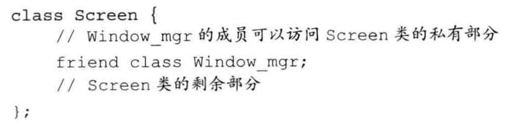
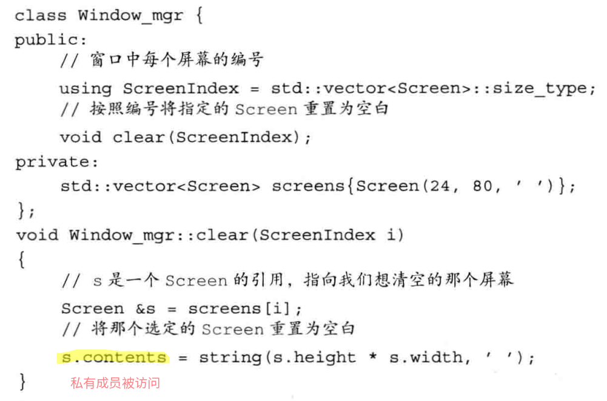
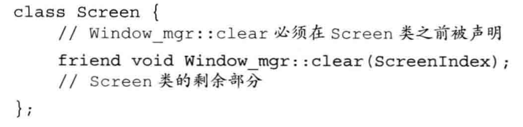
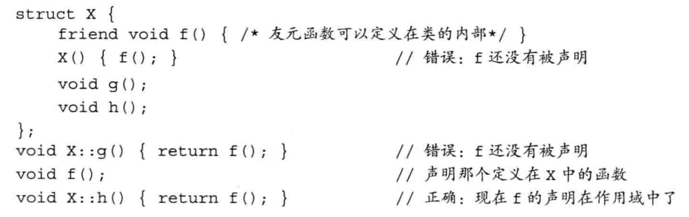
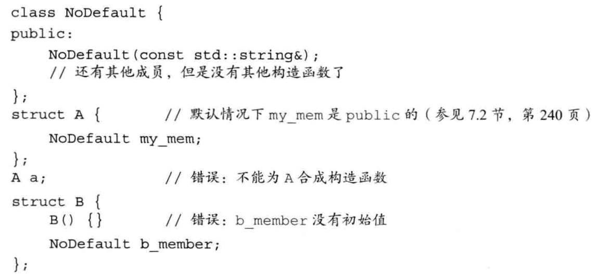

# 第七章 类
@(Coding)[C++, 笔记, C++ Primer]

## 7.1 定义抽象数据类型
类的基本思想是数据抽象和封装. 数据抽象是一种依赖于接口和实现分离的的编程技术.封装实现了类的接口和实现的分离.
成员函数: 类的实现 类的接口. 类的接口通用,类的实现不通用

### 7.1.2 定义成员函数
`std::string isbn() const {return bookno;}`
类的成员函数必须在类内声明,定义可以在类外.类内定义的成员函数是隐式的inline函数.
`inline`关键字在类内显式声明内联函数,须在类外定义(还是声明?)函数(不加inline关键字).
**this指针**
成员函数通过this隐式参数访问调用自身的对象
```
total.isbn();
Sale_data::isbn(&total);	///等价的认为
```
在成员函数内, 对象的成员可以被直接访问 - 对this指针的隐式引用.
this指针可以被显式使用.
this指针是常量指针
**const成员函数**
const: 修改隐式this指针的类型
默认: this指针是指向类类型非常量版本的常量指针
在形参列表后加const关键字: this指针是指向常量的指针
常量类类型不能访问非常量成员函数
**类作用域**
先编译成员声明,再编译成员函数体
**类外声明函数体**
`double Sales_data::avg_price() const{
	...;}`
如果成员被声明成常量成员函数,定义时也需要有const关键字
**返回this对象的函数**
```
Sale_data& Sale_data::combine(const Sales_data &rhs){
units_sold += rhs.units_sold;
revenue += rhs.revenue;
return *this;
}	///返回改变了的原对象
```
### 7.1.3 类相关的非成员函数
接口函数,不属于类本身
与类声明放在同一个头文件内
**定义read和print**
IO类型不能被拷贝, 做形参时使用引用类型
在实现接口函数时,print函数不使用换行符.换行由用户控制
### 7.1.4 构造函数
与类名同名,无返回值,可以有多个构造函数,必须在形参类型和形参个数有区别.
构造函数不能被声明为const函数.常量类类型是在对象构造后常量化的
**默认构造函数**
无实参.
无显式默认构造函数时,编译器会自动隐式定义默认构造函数(**合成的默认构造函数**)
合成的默认构造函数
- 利用类内存在的初始值初始化成员
- 否则,默认初始化方式

尽量不使用合成的默认构造函数
- 存在显式构造函数,编译器不再生成合成的默认构造函数
- 合成的默认构造函数容易产生错误操作.内置类型成员进行默认初始化(同局部变量)
- 编译器在某些条件下不能生成合成的默认构造函数.如类成员为另一个类,且这个类无默认构造函数

C++11使用`=default`要求编译器生成默认行为的构造函数
```
class T{
	T() = default;
};		///= default可以在类内可以在类外
```

**构造函数初始化列表**
```
Sales_data(const std::string &s):bookNo(s){
}
Sales_data(const std::string &s, unsigned n,   double p):
		   bookNo(s),            units_sold(n),revenue(p*n){
}
```
`:var1(val1),var2(val2),...`
初始化列表部分初始化构造函数形参时,未显式表示的变量将根据合成默认构造初始化的方式初始化.
构造函数使用类内初始值.但如果编译器不支持类内初始值,则应该显式的使用构造函数初始化列表初始化所有类成员变量.
构造函数不应该轻易覆盖类内初始值,除非新赋的值与原值不同.
构造函数初始化列表初始化成员变量顺序是按照**变量的声明顺序**初始化的

**类外定义的构造函数**
需要iostream等的构造函数,函数体内可能调用read()等外部接口函数,在类外定义构造函数
没有初始化列表 - 初始化列表为空, 将执行类内初始值初始化,或默认初始化

### 7.1.5 拷贝/赋值和析构
- 编译器处理
- 自定义(重载)

**不能合成的类**
ex:管理动态内存的类
很多需要动态内存的类能(且应该)使用vector和string对象管理必要的储存空间.使用vector或者string的类能避免分配和释放内存带来的复杂性.
即:类包含vector或者string成员,则拷贝\赋值和析构的合成版能够正常工作.


## 7.2 访问和控制封装
访问说明符:public: , private: , protected:
public: - 整个程序都能访问, 定义类的接口
private: - 只能被类的成员函数访问. 实现部分封装
类内可以包含0-多个访问说明符,可重复出现,直至下一个说明符出现访问控制级别相同.
**类的默认访问说明符**
任何类都可以使用struct和class关键字定义.
struct定义的类,默认访问控制为public,
class定义的类,默认访问控制为private.
### 7.2.1 友元
对于private数据成员,类外声明的接口函数不能正常访问,因此需声明为友元.
类允许其他类或者函数访问非公有成员,方法是令其他类或者函数声明为友元,方法:在类内加`friend`开头的函数或类声明.
友元声明只能在类内部声明,但声明位置不限,一般在类的开头或结尾集中声明友元.友元不是类的成员函数,不受他所在区域访问控制级别限制.
**封装的好处**
- 防止类用户修改封装对象的状态
- 方便类实现细节的改变,不涉及类用户代码

**友元的声明**
友元的声明仅仅是一个形式,用来指明访问权限,必须在类外专门进行一次函数或者类的声明(不加`friend`).建议将友元的声明和类本身的声明放在同一个文件夹.

## 7.3 类的其他特性
### 7.3.1 类成员再探
**类型成员**
类内自定义某种类型在类中的别名
```
class screen{
public:
	typedef std::string::size_type pos;   ///自定义别名
	///using pos = std::string::size_type; 类型别名 等价与上式
private:
	pos curcor = 0;
	pos height = 0, width = 0;
	std::string contents;
};
```
类内用来定义类型的成员必须先定义后使用,有顺序的区别,通常定义在类开始的地方.
**成员函数**
```
class Screen{
public:
	typedef std::string::size_type pos;     ///自定义别名 
											///using pos = std::string::size_type; 类型别名 等价
	Screen() = default;    ///有显式构造函数,不再生成合成默认版本,需显式定义
	Screen(pos ht, pos wd, char c):height(ht), width(wd),contents(ht*wd,c){}
	char get() const
		{return contents[cursor];}     ///隐式内联
	inline char get(pos ht, pos wd) const;     ///显式内联
	Screen &move(pos r; pos c);     ///可以在之后设为内联函数(????)
private:
	pos curcor = 0;
	pos height = 0, width = 0;
	std::string contents;

};
```
第二个构造函数为cursor成员隐式的使用了类内初始值.

**内联成员函数**
类的规模较小的函数适宜被声明为内联函数.
在类内部定义成员函数自动是inline的,但是需注意过长的类内定义函数不会被作为inline函数.
内联函数的形式
- 隐式内联
- 类内显式inline
- 类外显式inline
- 类内外同时显式inline

显式inline时,建议在类外定义部分说明inline, 容易理解.
inline函数定义在头文件
inline成员函数也应与相应的类定义在同一头文件中

**重载成员函数**
须在参数的数量和/或类型上有区别

**可变数据成员**
在变量声明前加`mutable`关键字.
可变数据成员可以被改变,永远不会是const,即使在const成员函数中.

**类数据成员的初始值**
一个类的对象作为另一个类的数据成员时,我们希望这个对象在开始时始终拥有固定初始值
```
class Window_mgr{
private:
	std::vector<Screen> screens{Screen(24, 80, ' ')};   ///后面Screen的值被传递给vector<Screen>的构造函数
};
```
类内初始值必须使用=初始化或者花括号括起来的直接初始化.

### 7.3.2 返回*this的成员函数
**const成员函数返回*this**,则返回类型应为常量引用
**基于const的重载**
非常量版本的成员函数常量对象不可用,常量对象只能使用const成员函数.非常量对象可以调用常量成员函数和非常量成员函数,但可以区分更好的匹配.
```
class Screen{
public:
	Screen &display(std::ostream &os)
			{do_display(os); return *this;}
	const Screen &display(std::ostream &os) const
			{do_display(os); return *this;}

private:
	void do_display(std::ostream &os) const{
		os << contents;}
};
```
上述代码对公有代码使用私有功能函数的优点:
- 避免重复同样代码
- do_display的后续拓展
- 方便do_display内添加调试信息,在发行版本去掉
- 没有额外开销.do_display隐式内联

### 7.3.3 类类型
类定义了唯一的类型.即使类成员完全一致,但类名不一致,即为两种不同的类型.
对象的定义方式:
```
Sales_data item1;
class Sales_data item2;   ///C风格
```
**类的声明**
类的声明和定义可以分开进行,仅声明暂时不定义:**前向声明**,是一个**不完全类型**
不完全类型的使用情形:
- 定义该类类型的指针和引用
- 声明(不能被定义)该类类型的作为形参或返回类型的函数

**例外**:只有类被定义后数据成员才能被声明为这种类型.只有在类定义后才能定义对象,因此在类内不能使用该类作为成员,但是可以使用其指针和引用.

### 7.3.4 友元再探
某类内声明的友元函数或者友元类可以访问该类的私有成员
普通函数\其他类\其他类的成员函数\隐式内联(类内定义成员函数)
**类之间的友元关系**



**友元关系不具有传递性**

**令成员函数作为友元**

成员函数做友元的声明和定义的依赖关系:
1. 定义Window_mgr类,声明但不定义clear函数.在clear函数使用Screen成员前先声明Screen.
2. 定义Screen类, 包括对clear的友元声明
3. 定义clear函数, 在其中使用Screen的成员

**函数的重载和友元**
对于重载衍生的一个系列的函数, 如果要声明为友元需对每个函数都声明友元.

**友元声明和作用域**

类和非成员函数的**声明**不是必须在它们的**友元声明**之前.当一个名字第一次出现在一个友元声明中时,我们隐式的假定该名字在当前作用域是可见的(**声明**不一定在当前作用域内).
在类内定义的友元函数,必须在类外再**声明**一遍.

## 7.4 类的作用域
常见类操作:
```
Screen::pos ht = 24, wd = 80;
Screen scr(ht, wd, ' ');

Screen *p = &scr;

char c = scr.get();
c = p->get();
```

**定义在类外部的成员的作用域**
```
void Window_mgr::clear(ScreenIndex i) {}
Window_mgr::ScreenIndex Window_mgr::addScreen(const Screen &s) {}
```

### 7.4.1 名字查找和类的作用域
**名字查找**
非类成员:
1. 块内(之前部分)查找声明
2. 外层查找声明
3. 没找到报错

类成员函数:
1. 编译成员函数声明
2. 类全部可见后编译函数体

**类内名字声明查找**
类内声明中的返回类型和形参,必须保证声明前可见.
```
typedef double Money;
string bal;
class Account{
public:
	Money balance() {return bal;}
	///Money 的声明为前文中的定义. bal的声明为后文中的bal,非前文的string bal.
private:
	Money bal;
};
```
返回类型Money的名字查找过程:在Account类的范围内查找声明,只考虑Account中在使用Money前出现的声明,没有,编译器在Account外层作用域查找.
函数体bal的名字查找过程:balance函数体在Account类可见后处理,因此bal成员为类内的bal.

**类型名的处理方式**
一般情况内层作用域可以重新定义外层作用域中的名字.
但类内不能重新定义之前出现的名字,即使在类内重新定义一个完全相同的名字(以及类型)也不行
```
typedef double Money;
class Account{
typedef double Money;	///错误
};
```

类型名的定义通常在类开始的地方,保证对其他成员可见.

**成员定义中的普通块作用域的名字查找**
1. 在成员函数中查找名字的声明
2. 在类内查找,查找范围是所有成员
3. 在成员函数定义前的作用域内查找

举例(代码风格不佳,仅举例)
```C++
int height;
class Screen{
public:
	typedef std::string::size_type pos;
	void dummy_fcn(pos height){
		cursor = width * height;   ///height为上行height
		cursor = width * this->height;   ///上上行height隐藏了类成员height,
										 ///通过this指针显式的实现调用类成员height
		cursor = width * ::height;   ///height为类前声明的height
	}
private:
	pos cursor = 0;
	pos height = 0, width = 0;
};
```

**在文件中名字的出现处对其进行解析**
成员函数定义在类外,名字查找在类外查找时,一要考虑函数声明前的外部作用域声明,二要考虑函数定义前的作用域的声明.

## 7.5 成员函数再探

### 7.5.1 构造函数初始化列表
对象的数据成员,初始化和赋值是不同的
没有在构造函数初始化列表显式初始化的成员进行默认初始化.
构造函数可以在函数体赋值初始化成员,但这样不推荐.

**构造函数的初始值有时必不可少**
1. 成员是const(不能给const赋值)或者引用(引用必须在定义时初始化)
2. 成员属于某种类类型且该类没有定义默认构造函数

构造函数执行,意味着对象初始化完成,以上两种情况必须在构造函数通过初始化列表完成.

**使用构造函数初始值**
- 底层效率高
- 一些数据成员必须在构造时初始化

**成员初始化的顺序**
构造函数初始值列表只说明了初始化成员的值,不限定初始化顺序.
初始化顺序与它们在类中的声明顺序有关. 注意初始化时成员的依赖关系,尽量避免使用某些成员初始化其他成员
友好的编译器提供顺序不一致的警告.

建议使用构参函数的参数作为初始值,尽量避免用一些成员初始化其他成员,避免了考虑初始化成员的依赖关系.

**默认实参和构造函数**
以默认实参的形式实现定义默认构造函数
```C++
class Sales_data{
public:
	Sales_data(std::string s = " "):bookNo(s) { }
	///定义默认构造函数,令其与只接受一个string形参的构造函数功能相同
};
```
为多个形参的构造函数全部提供默认实参,也定了默认构造函数,但要谨慎为多形参构造函数同时提供默认值.

### 7.5.2 委托构造函数
委托构造函数:使用它所属的类的其他构造函数执行它自己的初始化过程,即它把自己的一些(或全部)职责委托给了其他构造函数.
委托构造函数也有一个成员初始化值列表和一个函数体.成员初始化值列表只有唯一入口: 类的另一个带实参构造函数.
```C++
class Sales_data{
public:
	///非委托构造函数
	Sales_data(std::string s, unsigned cnt, double price):
			   bookNo(s),     units_sold(cnt), revenue(cnt*price) { }
	///以下三个为委托构造函数
	Sales_data():Sales_data(" ", 0, 0) { }   ///默认构造函数
	Sales_data(std::string s):Sales_data(s, 0, 0) { }
	Sale_data(std::istream &is):Sales_data() {read(is *this);}   ///委托构造函数再次委托构造
};
```
在委托构造函数中,受委托的构造函数的初始值列表和函数体被依次执行,然后控制权再交给委托者的函数体.

### 7.5.3 默认构造函数的作用(有点乱)
当对象被默认初始化或值初始化时自动执行默认构造函数.
默认初始化情形:
- 在块作用域内不使用任何初始值定义一个非静态变量或数组
- 类本身含有类类型的成员且使用合成默认构造函数
- 类类型的成员没有在构造函数初始之列表中显式初始化时


值初始化情形:
- 在数组初始化的过程中提供的初始值数量少于数组大小
- 不使用初始值定义一个局部静态变量
- 通过`Duixiang( )`形式显式请求值初始化

隐式的默认初始化是未定义的. 隐式的值初始化是被定义为默认值.

**使用默认构造函数**
```
Sales_data obj();	///错.函数
Sales_data obj;	///对.对象
```

### 7.5.4 隐式的类类型转化
如果构造函数只接受一个实参,实际上定义了转换为此类类型的隐式转化规则: **转换构造函数**
能够通过一个实参调用的构造函数定义一条从构造函数的参数类型向类类型隐式转换的规则.(????)


```
Sale_data& Sale_data::combine(const Sales_data &rhs){
units_sold += rhs.units_sold;
revenue += rhs.revenue;
return *this;
}
```
```
string null_book = "9-999-99999-9"
item.combine(null_book);
///构造一个临时的Sales_data对象(临时量)
///该对象的units_sold和revenue等于0,bookNo等于null_book
```
类对象作为实参时可以使用转换构造函数.


**只允许一步类类型转换**
```
item.combine("9-999-99999-9");	///错误,"9-999-99999-9" - string - Sales_data
item.combine(Sales_data("9-999-99999-9"));
```
**类类型转换不是总有效**
**抑制构造函数定义的隐式转换**
在一个实参的构造函数前加`explicit`关键字
`explicit`关键字只对一个实参的构造函数有效,多个实参的构造函数不能用于执行隐式转换,无需`explicit`
只能在类内声明构造函数时使用`explicit`关键字,在类外定义时不应重复.

**`explicit`构造函数只能用与直接初始化**
执行类类型的拷贝初始化时也会发生隐式转换
```
class Sales_data{
...
explicit Sales_data(const std::string &s):bookNo(s) { }
...
};
```
```
Sales_data item1(null_book);	///正确,直接初始化
Sales_data item2 = null_book;	///不能将explicit构造函数用于拷贝形式的初始化过程
```

**为转换显式地使用构造函数**
尽管编译器不会将explicit的构造函数用于隐式转换过程，但是我们使用这样的构造函数显式地强制进行转换
```
item.combine(Sales_data(null_book));	///显式构造的Sales_data临时量
item.combine(Sales_data(cin));	///
item.combine(static_cast<Sales_data>(cin));	///static_cast可以使用explicit构造函数.执行了显式而非隐式的转换,static_cast使用istream形参构造函数创建了一个临时的Sales_data对象
```
在第一调用中，我们直接使用Sales_data的构造函数，该调用通过接受string的构造函数创建了一个临时的Sales_data对象。第二个调用，我们使用static_cast执行了显式的而非隐式的转换。其中，static_cast使用istream构造函数创建了一个临时的Sales_data对象。
三者的区别(????)

**标准库中含有显式构造函数的类**
- 接受单参数的const char*的string构造函数,不是explict的
- 接受一个容量参数的vector构造函数,是explicit的

### 7.5.5 聚合类
聚合类:用户可以直接访问其成员,并有特有的初始化语法.
- 所有成员都是public
- 没有定义任何构造函数
- 没有类内初始值
- 没有基类,没有virtual函数

```
struct Data{
	int ival;
	string s;
};

Data vall = {0, "Anna"};
///vall.ival = 0; vall.s = string("Anna");
```

聚合类特有的初始化形式:花括号+成员初始值列表(顺序与声明严格一致).
初始值列表元素个数少于声明时,后面的元素被值初始化.初始值列表元素个数不得多于声明.

### 7.5.6 字面值常量类
