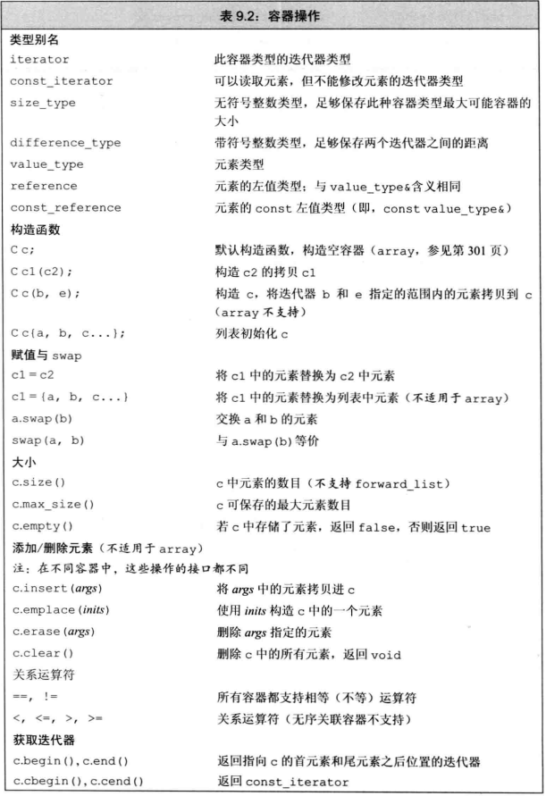
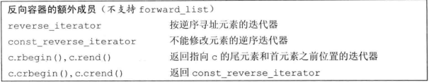
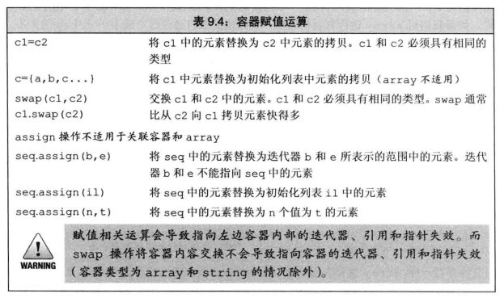
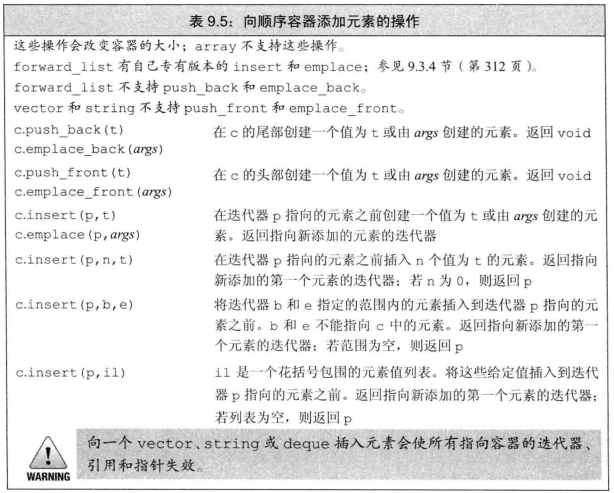
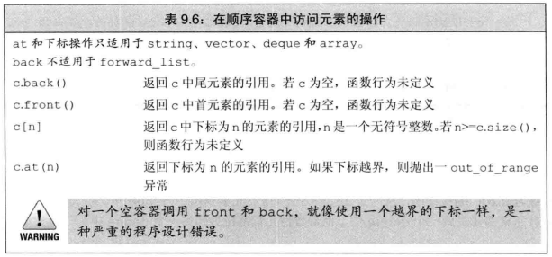
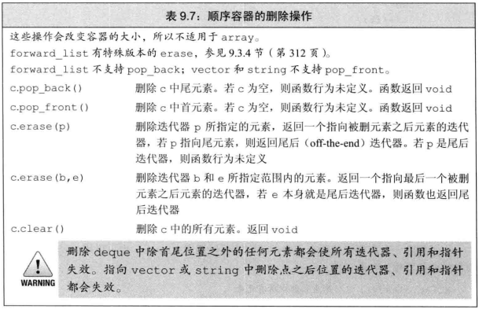
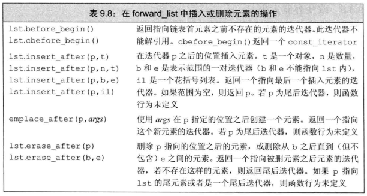
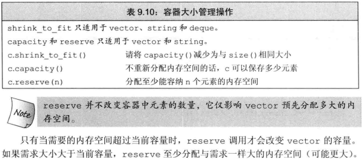
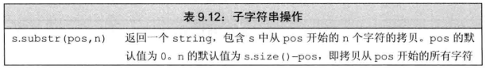
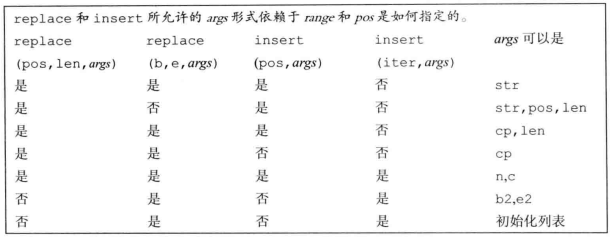

# 第九章 顺序容器
@(Coding)[C++, 笔记, C++ Primer]

容器:特定类型对象的集合.
顺序容器:提供了控制元素存储和访问顺序的容器.顺序与加入容器时位置相对应.
标准库提供三种容器适配器,分别为容器操作定义不同的接口,来与容器类型适配.
## 9.1顺序容器概述
所有顺序容器都能快速顺序访问元素,但在一下方面存在性能折中:
- 向容器添加或删除元素的代价
- 非顺序访问容器元素的代价

```
vector 可变大小数组,支持快速随机访问.在非尾部插入或删除元素很慢
deque 双端队列.支持快速访问.在头尾插入删除很快
list 双向链表.支持双向顺序访问.在任意位置插入删除很快
forward_list 单向链表.支持单向顺序访问.在任意位置插入删除很快 C++11
array 固定大小数组.支持快速随机访问.不能添加和删除元素 C++11
string 与vector类似,专用于字符
```

vector string在内存中连续储存,可以通过下标快速访问
deque跟vector类似,但支持头尾增删元素,速度与list和forwar_list相当
list forward_list可以随意增删元素,不支持随机访问,内存开销大
array比传统数组更安全易用,不能添加删除元素和改变大小
forward_list 达到最佳的手写单项链表的性能.因此没有size操作

现代C++使用标准库容器,避免数组等更原始的数据结构

**容器选择原则**
通常最常用vector;
小元素多,空间开销要求高,避免使用list和forward_list;
在中间增删元素,避免使用vector和deque;
随机访问元素,避免使用vector和deque;
在头尾操作,不在中间操作,使用deque;
在读取输入时在中间插入元素,随后进行随机访问:
- 是否必须在中间插入.在输入数据时,vector方便追加数据,通过sort函数重排元素
- 必须在中间插入元素.输入阶段采用list,完毕后拷贝到vector中

不确定使用哪种容器,则只采用vector和list的公共操作:使用迭代器,不使用下标操作,避免随机访问.在之后切换vector或list都方便.

## 9.2 容器库
容器继承关系层次:
- 所有容器通用的操作




- 仅针对顺序容器\关联容器\无序容器的操作
- 小部分容器适用的操作

1. 每个容器都定义在一个头文件中, 文件名与类型名同名
2. 容器均定义为模板类
3. 对于大多数容器,非所有容器,需要定义额外的元素类型信息

**容器的元素类型**
顺序容器几乎可以定义所有数据类型的元素.特别的

```
vector<vector<string> > v; ///vector的vector.在老的编译器中需在后面的两个右尖括号之间加空格,新版本不需要.
```

某些容器操作对元素类型有自己的特定要求,在为这些有特定操作需求的类型定义容器时,只能使用那些没有特别要求的容器操作.例如:
顺序容器构造函数的一个版本接受容器大小参数,它使用了元素类型的默认构造函数.当类没有默认构造函数时,不能只传递元素数目参数:

```
vector<noDefault> v10(10);	///错误
vector<noDefault> v10(10, init);	///错误
```

### 9.2.1 迭代器
容器的迭代器也有公共接口,例如:
所有迭代器都可以通过解引用运算符来实现对元素的操作
所有迭代器都有递增运算符

迭代器支持表3.6(p96)的所有操作,但forward_list不支持递减运算符
表3.7(p99)中的算术运算,只适用于string vector deque array,其他不适用.

```
list<string>::iterator iter;
vector<int>::difference_type count;
```

**迭代器范围**

由指向同一容器的~~头~~元素的begin和指向尾元素之后位置的end这对迭代器表示:`[begin, end)`

迭代器范条件:
他们指向同一个容器中的元素或者容器最后一个元素之后的位置;
可以通过反复的递增begin来到达end.

### 9.2.2 容器类型成员
**反向迭代器**: 反向遍历容器的迭代器,,各种操作含义颠倒. 10.4.3

迭代器的**类型别名**:
再不了解容器类型的情况下使用其元素:`value_type`
元素类型的引用:`reference`或`const_reference`

### 9.2.3 begin和end成员

```
list<string> a = {"Milton", "Shakespeare", "Austen"};
auto it1 = a.begin();	///list<string>::iterator
auto it2 = a.rbegin();	///list<string>::reverse_iterator
auto it3 = a.cbegin();	///list<string>::const_iterator C++11
auto it4 = a.crbegin();	///list<string>::const_reverse_iterator C++11
```

不已c开头的1函数都是重载过的,有常量个非常量两个版本.
auto特性是C++11后特有的,之前需显式定义变量类型.

```
auto it7 = a.begin();	///当a为const对象时,it7是const_iterator
auto it8 = a.cbegin();	///不管a是否为const对象,it8是const_iterator
```

### 9.2.4 容器定义和初始化
除array,其他容器类型的默认构造函数都会创建一个指定的空容器,且都能指定容器的大小和元素初始值的参数.

```
C c;	///array默认初始化.其他空
C c1(c2);	///拷贝初始化.容器类型,元素类型,array大小相同
C c1 = c2;	///拷贝初始化.容器类型,元素类型,array大小相同
C c{a,b,c};	///列表初始化.c初始化为初始化列表中元素的拷贝.元素类型,array大小相同,未显式初始化的部分值初始化.
C c = {a,b,c};	///列表初始化.c初始化为初始化列表中元素的拷贝.元素类型,array大小相同,未显式初始化的部分值初始化.
C c(b,e);	///c初始化为迭代器b和e指定范围的元素的拷贝.
C seq(n);	///仅顺序容器.seq包含n和元素,都进行了值初始化.构造函数为explicit
C seq(n,t); ///仅顺序容器.n个初始化为t的元素
```

**将一个容器初始化为另一个容器的拷贝**
1. 直接拷贝整个容器.容器的类型及其元素类型必须匹配.
2. array除外,拷贝迭代器对指定的元素范围. 不要求容器类型相同,元素类型也可以不相同,只要能类型转换即可.

```
list<string> list<authors>;
forward_list<string> words(articles.begin(), articles.end());
deque<string> authList(authors.begin(), it);
```

**列表初始化**
初始化列表隐式制定了容器大小.
**与顺序容器相关的的构造函数**
元素为内置类型或有默认构造函数的类类型:C seq(n); 或 C seq(n,t);
没有默认构造函数的类类型:C seq(n,t);

**标准库array具有固定大小**
```
array<int,42>
```
不支持普通容器构造函数
array默认构造函数是非空的.对象元素被默认初始化.
部分初始化后的元素执行值初始化.
**数组不能进行拷贝或对象赋值, array能进行拷贝或对象赋值**

### 9.2.5 赋值和swap
容器赋值需两侧类型相同,左侧容器与右侧容器相等,大小也一致.
```
array<int,10> a1 = {0,1,2,3,4,5,6,7,8,9};	///正确列表初始化
array<int, 10> a2 = {0};	///正确,部分列表初始化
a1 = a2;
a2 = {0};	///错误????
```



**assign**
assign成员可以从不同但相容的容器赋值,或者从容器的一个子序列赋值,但迭代器对参数不是指向原容器.

**swap**
交换两个相同类型的容器的内容.
除array, swap并没有改变两个容器的元素,不进行拷贝插入删除,只交换容器的内部数据结构.
除string,指向容器的迭代器,引用,指针不会失效. a.swap(b)后,指向a的迭代器,引用,指针变为指向b的迭代器,引用,指针.
array的swap操作会发生元素值交换,迭代器,引用,指针不会失效,但是元素值已经发生交换.

建议使用非成员版本的swap: `swap(a, b)`, 有利于泛型编程.

### 9.2.6 容器大小操作
forward_list 支持max_size和empty
其他容器 支持size, max_size和empty.

### 9.2.7 关系运算符
==和!= 所有容器都支持
关系运算符 无序关联容器以外的所有容器支持

比较两个两个容器大小,前提同容器类型且元素类型也相同,比较原则先逐元素后容器size(如果元素没有定义该运算符也无法比较)

## 9.3 顺序容器操作
| container |快速添加|元素访问| push/emplace_back | push/emplace_front |insert/emplace|
|:--------- |:-----:|:-------:| :--------------------: | :---------------------: | :-----------: |
|vector     |尾部|快速随机访问| Y                       | N                        |Y|
|string     |尾部|快速随机访问| Y                       |  N                       |Y|
|deque      |双向|快速随机访问| Y                       |  Y                       |Y|
|list       |双向|顺序访问| Y                       |  Y                       |Y/快速|
|forward_list|头部|顺序访问|  N                     |  Y                       |特有/快速|
|array      |N|随机访问|   N                     |  N                       |N|

### 9.3.1 向顺序容器添加元素

**push_back**
list vector string deque尾部创建一个新元素拷贝入值, size+1.
使用一个对象初始化容器或者将一个对象插入容器,实际是对象值的拷贝,类似于非引用传参.两者值的变化互不影响
**push_front**
list deque forward_list头部创建一个新元素拷贝入值, size+1.

**insert**
任一位置的插入
迭代器作为第一个参数. 尾后迭代器原因,在第一个参数位置之前添加元素

**insert返回值**
反复插入:
```
list<string> lst;
auto iter = lst.begin();
while(cin >> word)
	iter = lst.insert(iter, word);
```

**emplace**
构造元素而非拷贝
emplace: 将参数传递给元素类型的构造函数,在容器内存空间直接构造元素.
非emplace的同功能函数是创建一个临时对象,将其压(拷贝)入容器.
```
emplace(arg);
```
arg必须与容器元素构造函数能接受的参数匹配.
```
c.emplace_back();	///Sales_data默认构造函数
c.emplace(iter, "999-999999");	///Sales_data(string)构造函数
c.emplace("999-999999", 25, 15.99);	///Sales_data(ISBN, Count, Price)构造函数
```

### 9.3.2 访问元素

| container | c.back() | c.front() | c(n) | c.at(n) |
|:--------- |:--------:|:---------:| :--: | :-----: | 
|vector     | Y        | Y         | Y    | Y       |
|string     | Y        | Y         | Y    | Y       |
|deque      | Y        | Y         | Y    | Y       |
|list       | Y        | Y         | N    | N       |
|forward_list| N        | Y         | N    | N       |
|array      | Y        | Y         | Y    | Y       |



包括array在内的每个顺序容器 都有一个front成员函数;
除forward_list之外所有容器都有back成员函数.

```
//在解引用一个迭代器或调用front或back之前检查是否有元素.
forward_list<string> c;
if(!c.empty()){
	auto val = *c.begin(), val2 = c.front();
	auto last = c.end();
		auto val3 = *(--last);///不能递减forward_list迭代器
		auto val4 = c.back();///forward_list不支持back
}
```

获得首位元素引用的两种方法:
1. 直接调用front和back
2. 解引用begin返回的迭代器来获得首元素的引用????????,并且通过递减并进行解引用end获得尾元素的引用.

**访问成员函数返回的是引用**
if(!c.empty()){
	c.front = 42;///容器的第一个元素值为42
	auto &v = c.back();///容器的尾元素改变
	v = 1024;
	auto v = c.back();///v为拷贝,容器未改变
	v = 0;
}

**下标操作与安全随机访问**
使用at().少用(n)

### 9.3.3 删除元素

| container | c.pop_back() | c.pop_front() | c.erase(p)/(b,e) | c.clear() |
|:--------- |:--------:|:---------:| :--: | :-----: | 
|vector     | Y        | Y         | Y    | Y       |
|string     | Y        | Y         | Y    | Y       |
|deque      | Y        | Y         | Y    | Y       |
|list       | Y        | Y         | N    | N       |
|forward_list| N        | Y         | N    | N       |
|array      | Y        | Y         | Y    | Y       |



### 9.3.4 特殊的forward_list操作



forward_list添加删除元素是通过改变给定元素之后的元素完成的,需要关注元素及前驱.
```
forward_list<int> flst = {0,1,2,3,4,5,6,7,8,9};
auto prev = flst.begin_before();
auto curr = flst.begin();
while(curr != flst.end()){
	if(*curr % 2)
		curr = flst.erase_after(prev);
	else{
		prev = curr;
		++curr;
	}
}
```

### 9.3.5 改变容器的大小
```
list<int> ilist(10, 42); ///10个42
ilist.resize(15);	///添加5个0
ilist.resize(25. -1);	///再添加10个-1
ilist.resize(5);	///只保留前5个
```
### 9.3.6 容器操作可能使迭代器失效

|  插入操作  | 重新分配空间 | 不重复分配空间 | 特殊位置 |
|:--------- |:----------:|:-----------:| :-----: |
|vector     | 失效       | 插入之后的失效  | 无    |
|string     | 失效       | 插入之后的失效  | 无    |
|deque      | 失效 | 失效 | 首尾:迭代器失效,指针引用不失效 |无|
|list       | 有效 |有效 |无|
|forward_list| 有效|有效|首前和尾后迭代器也有效  |
|array      | 无法操作 |无法操作 |无法操作 |

|  删除操作  | 重新分配空间 | 不重复分配空间 | 特殊位置 |
|:--------- |:----------:|:-----------:| :-----: |
|vector     | 失效       | 插入之后的失效  | 尾后迭代器一定失效     |
|string     | 失效       | 插入之后的失效  | 尾后迭代器一定失效     |
|deque      | 失效 | 失效 | 首尾:删除尾元素,尾后迭代器失效,其他无影响;删除首元素,无影响 |
|list       | 有效 |有效 | 无 |
|forward_list| 有效 | 有效 | 首前和尾后迭代器也有效  |
|array      | 无法操作 | 无法操作 | 无法操作 |

**编写改变容器的循环程序**
程序必须保证每步循环中更新迭代器,引用,指针.
```
vector<int> vi = {0,1,2,3,4,5,6,7,8,9};
auto iter = vi.begin();
while(iter != vi.end())
{
	if(*iter % 2){
		iter = vi.insert(iter, *iter);
		iter += 2;
	}else
		iter = vi.erase(iter);
}
```

**不要保存end返回的迭代器**
在添加删除vector,string,或deque首元素之外的元素,end返回的迭代器总是会失效.在添加删除元素的循环中必须反复调用end, 不能在循环之前保存end返回的迭代器.
```
auto begin = v.begin(), end = v.end();
while(begin != end) {}			///错误,行为未定义,死循环.

auto begin = v.begin();
while(begin != v.end()) {}			///正确
```

## 9.4 vector对象
vector/string在不得不分配新空间时,会分配比实际需求大的内存空间.可以保证扩张操作通常比list和deque还要快.


## 9.5 额外的string操作
### 9.5.1 构造string的其他方法




### 9.5.2 改变string的其他方法




### 9.5.3 string搜索操作


 
### 9.5.4 conpare函数


### 9.5.5 数值转换

## 9.6 容器适配器
